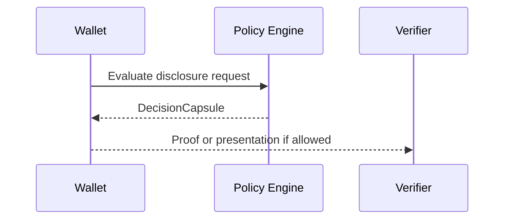

# [Component Name] Specification

## Purpose

[State the strict user or relying-party outcome. Avoid broad convenience claims.]

## Scope

- In scope:
- Out of scope:
- Owning package/app:

## Actors And Boundaries

| Actor/package | Responsibility | Data/proof handled | Retention |
| --- | --- | --- | --- |
| Wallet |  |  |  |
| Issuer |  |  |  |
| Verifier |  |  |  |
| Policy engine |  |  |  |

## Data Minimization

- Raw fields requested:
- Predicate/proof alternatives:
- Justification for any raw field:

## Legal And Privacy Basis

| Data/proof | Purpose | Basis/rationale | Protection | Retention |
| --- | --- | --- | --- | --- |
|  |  |  |  |  |

## Architecture



## Interfaces

```ts
import { z } from 'zod';

export const RequestSchema = z.object({
  // Define exact validated fields.
});

export type Request = z.infer<typeof RequestSchema>;
```

## Fail-Closed Behavior

- Missing policy:
- Unknown actor/schema:
- Resolver or revocation failure:
- Malformed input:
- Expired or replayed request:

## Audit Evidence

- Decision artifact:
- Reason codes:
- Hashes/signatures:
- PII avoided in audit:

## Implementation Plan

1. 
2. 
3. 

## Verification Plan

- Unit tests:
- Integration tests:
- Negative/fail-closed tests:
- Commands:
