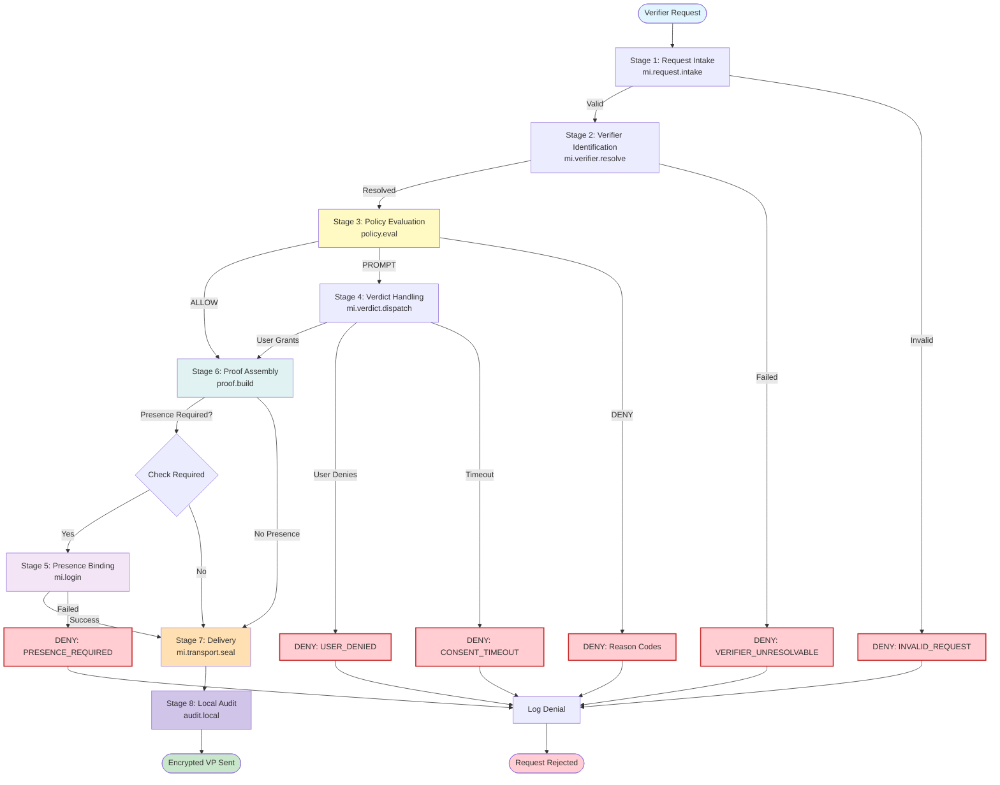

## Workflow Invariants Mapping

### Invariant 1: Request Integrity
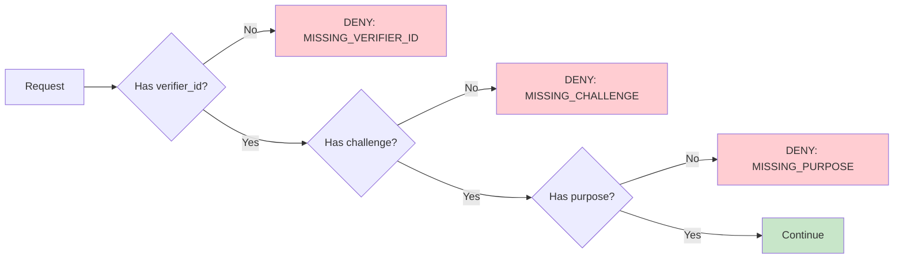

### Invariant 2: Unknown Verifier Blocking
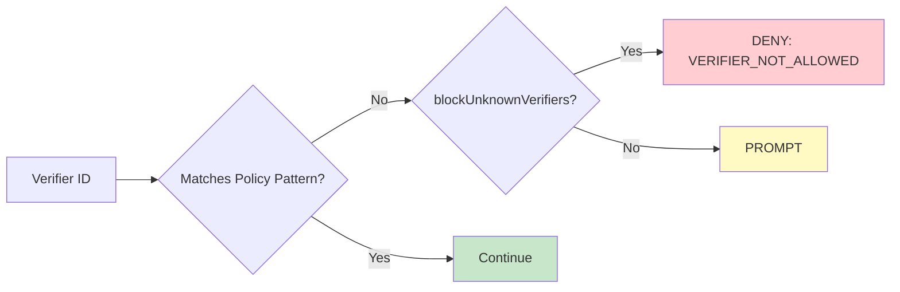

### Invariant 3: Claim Denial
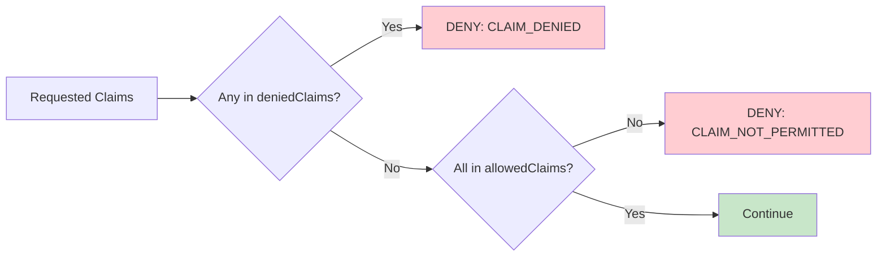

### Invariant 4: Presence Requirement
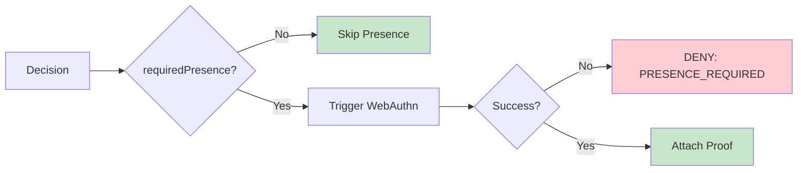

### Invariant 5: Issuer Trust
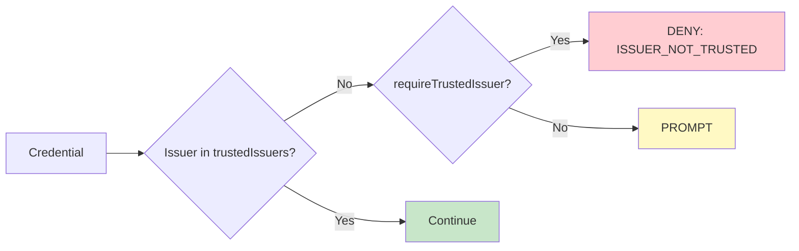

### Invariant 6: Replay Protection
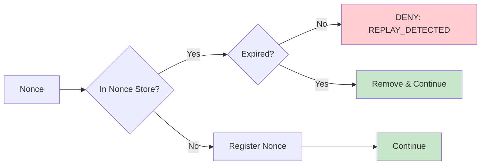

### Invariant 7: Temporal Validity
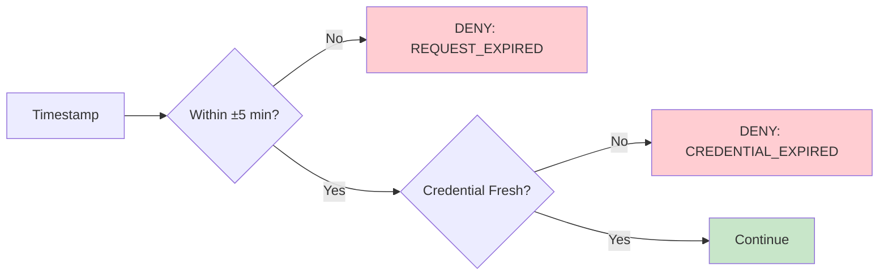

## Data Flow (Never Events Enforcement)

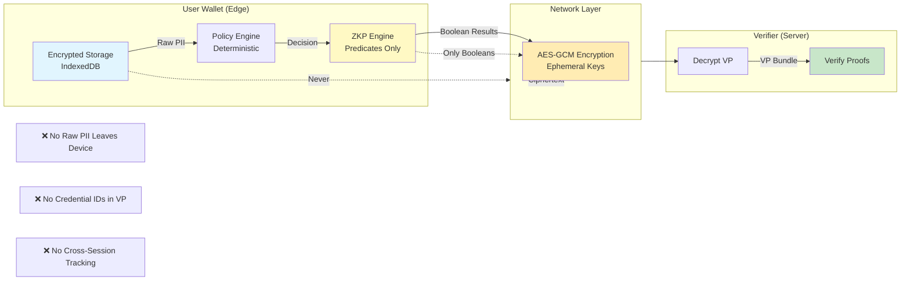

## Audit Chain Structure

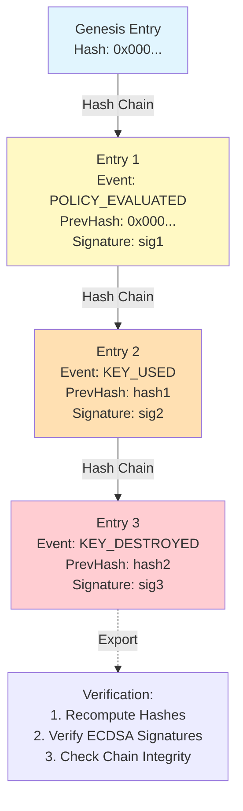

## Antigravity Workspace Integration

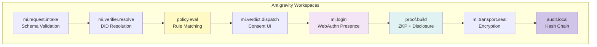
