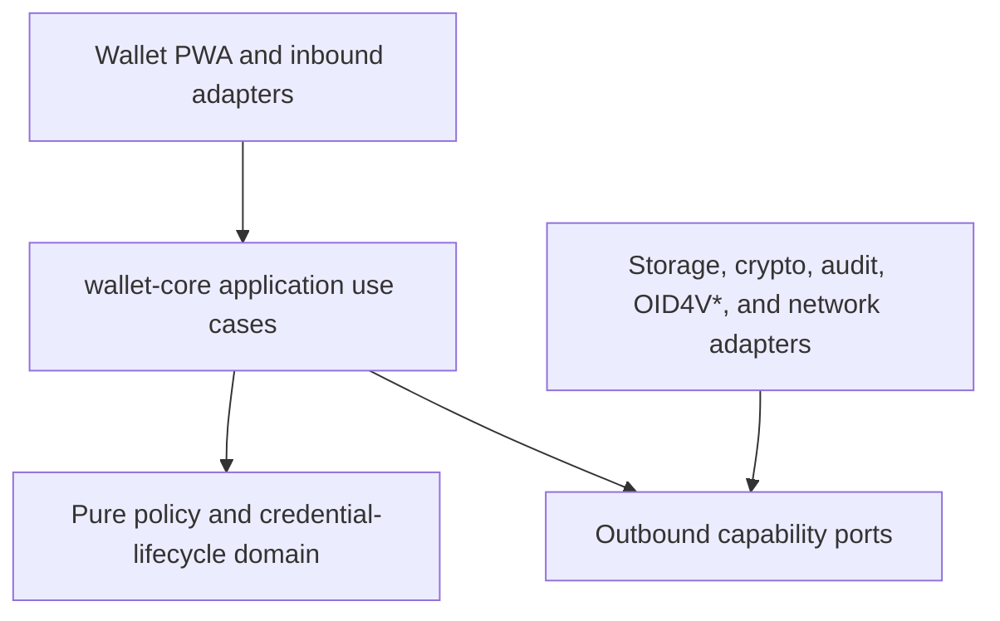

# AskMI Architectural Decoupling

> **Role:** Canonical architecture-boundary model, coupling audit, and migration gates.
> **Status:** AUTHORITATIVE
> **Owner:** Technology & Architecture Authority
> **Last verified:** 2026-08-20

## Authority and Baseline

This document is the single source of truth for AskMI's intended dependency
direction, the currently verified coupling findings, and the acceptance gates
for Phase 6 architecture work.

- Task status remains authoritative in [`../BACKLOG.md`](../BACKLOG.md).
- Migration sequencing remains authoritative in
  [`../REFACTORING_ROADMAP.md`](../REFACTORING_ROADMAP.md).
- Security invariants remain authoritative in
  [`../specs/112_Component_Isolation_Model.md`](../specs/112_Component_Isolation_Model.md).
- The WalletService decomposition decision is proposed in
  [`mvp/ADR-013_WalletService_Monolith_Decomposition_Strategy.md`](mvp/ADR-013_WalletService_Monolith_Decomposition_Strategy.md).

Audit baseline:

| Surface | Revision | Meaning |
|---|---|---|
| `master` | [`bb340038`](https://github.com/Late-bloomer420/miTch/commit/bb340038fdd4df98c6d2f2936f2a39ba7c872ac1) | Current runtime and documentation baseline |
| [PR #130](https://github.com/Late-bloomer420/miTch/pull/130) | `045fcdac0592fcbace9913ea377a9f5f45822c6a` | Open credential-pool wiring and dead-code sweep; PR-only findings are labelled |

This is a static architecture audit. It does not replace dynamic security
testing, interoperability testing, or the independent review required for
critical production changes.

## Executive Finding

AskMI is modular at the workspace-package level, but it is not yet cleanly
decoupled at runtime.

The repository graph contained 35 named package manifests (including the root)
and no production-dependency cycle at the audit baseline. The main risks are
instead:

1. competing runtime orchestration surfaces;
2. security decisions that are not structurally bound to the later side effect;
3. lifecycle rules implemented by several authorities;
4. domain code that performs browser, crypto, clock, ID, and mutable-state work;
5. intended boundaries that are documented but not statically enforced.

High production-dependency fan-in reinforces the blast-radius risk:
`@askmi/shared-types` has 21 repository consumers, `@askmi/shared-crypto` 14,
and `@askmi/policy-engine` 7. These packages need especially narrow and stable
public contracts.

## Canonical Layer Model



Dependencies point toward the stable core. Runtime control may flow outward
through ports, but domain and application packages must not import concrete
browser, persistence, network, audit, or cryptographic adapters.

### Layer Responsibilities

| Layer | Owns | Must not own |
|---|---|---|
| UI / inbound adapters | Rendering, user interaction, protocol-to-command mapping | Credential lifecycle, policy rules, raw-key access |
| Application (`wallet-core`) | Use-case ordering, transaction boundaries, fail-closed coordination | Browser globals or concrete infrastructure construction |
| Domain | Deterministic policy decisions, credential eligibility, pool rotation, state transitions | I/O, clocks, random IDs, WebCrypto, audit writes |
| Ports | Minimal capabilities required by application use cases | Adapter implementation details |
| Outbound adapters | IndexedDB, encryption, WebAuthn, audit persistence, OID4V*, HTTP | Cross-use-case business decisions |
| Composition root | Construct concrete adapters and inject them into the application facade | Domain behavior |

### Non-Negotiable Dependency Rules

1. `wallet-pwa` creates adapters and calls one `wallet-core` facade.
2. `wallet-core` owns its ports; adapter implementations depend on those ports.
3. The policy domain consumes a minimized `PolicyCredentialView`, not storage
   documents or browser-native key objects.
4. A raw credential can be loaded only from an authorized presentation plan.
5. A presentation builder cannot accept an arbitrary credential ID that is not
   bound to the policy result.
6. `DENY`, unresolved `PROMPT`, missing capabilities, and crypto failures cannot
   reach presentation generation.
7. Package boundaries cannot be bypassed with `as unknown as` casts.
8. There is one canonical `DecisionCapsule` contract and one canonical policy
   evaluation entry point.
9. Every verdict is audited; audit failure behavior is explicit and tested.
10. Single-use ambiguity fails closed and can never silently restore reusability.

## Findings Register

### ARCH-01 — Competing Wallet Orchestration Surfaces

**Priority:** P1 · **Status:** OPEN

**Evidence:** [`App.tsx`](../../src/apps/wallet-pwa/src/App.tsx),
[PWA-local `WalletService`](../../src/apps/wallet-pwa/src/services/WalletService.ts),
and [`wallet-core/WalletService`](../../src/packages/wallet-core/src/WalletService.ts).

The runtime PWA imports and constructs
`src/apps/wallet-pwa/src/services/WalletService.ts`, which is 2,317 lines at the
audit baseline. `@askmi/wallet-core` also exports an 84-line `WalletService`
facade and repository/evaluator interfaces, but the PWA imports only
`ReputationSensor` from that package.

The modular facade therefore does not govern the production wallet flow. The
repository's previous `R-02` completion marker described scaffolding, not a
completed runtime migration.

**Impact**

- behavior and interfaces can drift between two classes with the same role;
- ports may appear complete while new work continues in the local monolith;
- callers remain coupled to storage, audit, policy, crypto, protocol, recovery,
  and network behavior as one unit.

**Acceptance**

- the PWA constructs one facade from a dedicated composition root;
- the local class is reduced to a compatibility wrapper and then removed;
- no duplicate public `WalletService` authority remains;
- existing PWA public method behavior remains stable during migration.

### ARCH-02 — Presentation Is Not Structurally Bound to Authorization

**Priority:** P0 · **Status:** OPEN

**Evidence:**
[`WalletService.generateProximityResponse()`](../../src/apps/wallet-pwa/src/services/WalletService.ts)
and [Spec 112](../specs/112_Component_Isolation_Model.md).

`WalletService.generateProximityResponse()` currently:

1. accepts a caller-provided `credId`;
2. loads and decodes that raw credential before policy evaluation;
3. calls `evaluateRequest()` over wallet metadata;
4. does not explicitly gate the builder on `verdict === 'ALLOW'`;
5. does not prove that `credId` equals the credential selected by policy;
6. builds from the originally supplied credential and records `VP_SENT` with
   `status: 'SUCCESS'`.

The code does filter disclosed elements through the authorized claim set, so
this audit does not claim demonstrated raw-claim exfiltration. The structural
boundary is nevertheless unsound: the authorization result does not make the
subsequent credential choice unrepresentable.

**Required contract**

```ts
type AuthorizedPresentationPlan = {
  decisionId: string;
  verifierDid: string;
  nonce: string;
  credentials: Array<{
    id: string;
    authorizedClaims: string[];
    format: 'sd-jwt' | 'mso_mdoc';
  }>;
};
```

Only an `ALLOW` use case may create this value. Presentation builders accept
the plan, never a free credential ID plus an unrelated decision.

**Acceptance**

- raw loading occurs after authorization;
- `DENY` and unresolved `PROMPT` cannot call any builder;
- presented IDs exactly equal policy-selected IDs;
- mismatch, missing selection, and empty capsule tests fail closed;
- online SD-JWT and proximity mdoc flows use the same authorization use case.

### ARCH-03 — PolicyEngine Mixes Decision, State, Crypto, and Artifact Creation

**Priority:** P0 · **Status:** OPEN

**Evidence:** [`policy-engine/src/engine.ts`](../../src/packages/policy-engine/src/engine.ts).

`@askmi/policy-engine` currently combines:

- rule and credential evaluation;
- mutable in-memory rate limiting and risk accumulation;
- direct `Date.now()` timing;
- UUID and nonce generation;
- request/policy hashing;
- WebCrypto export of a response key;
- pairwise-DID creation and proof signing;
- DecisionCapsule construction and wallet-attestation coordination.

Most critically, pairwise-DID generation catches an exception and logs that it
is "continuing without it". That contradicts the repository-wide fail-closed
principle when unlinkability is a required property.

**Target split**

| Component | Responsibility |
|---|---|
| `PolicyDecisionEngine` | Pure `request + context + credential views + policy -> decision` |
| `RateLimitPort` | Stateful request/risk budget outside the pure engine |
| `DecisionCapsuleFactory` | Stable capsule construction from an approved decision |
| `PairwiseIdentityPort` | Create, bind, and destroy ephemeral identity material |
| `CapsuleSigner` | Sign the complete serialized capsule |
| `Clock` / `IdGenerator` | Inject time and identifiers for deterministic tests |

**Acceptance**

- equal inputs produce equal policy decisions;
- the pure engine imports no WebCrypto, clock, random-ID, or storage API;
- pairwise identity, key export, and signing failures return a typed denial;
- capsule construction has one versioned contract and focused tests.

### ARCH-04 — Credential Presentability Has Multiple Authorities

**Priority:** P1 · **Status:** OPEN; PR #130 contains an incomplete bridge

**Evidence:** [`single-use.ts`](../../src/apps/wallet-pwa/src/utils/single-use.ts),
[`credential-pool.ts`](../../src/apps/wallet-pwa/src/utils/credential-pool.ts),
[`policy-engine/src/engine.ts`](../../src/packages/policy-engine/src/engine.ts),
and the [PR #130 review](https://github.com/Late-bloomer420/miTch/pull/130).

Lifecycle selection is currently spread across:

- `utils/single-use.ts`, which removes `singleUse && consumedAt`;
- `utils/credential-pool.ts`, which models pool usage through `usedAt`;
- `PolicyEngine`, which independently skips `status: 'dispensed' | 'revoked'`;
- presentation generation, which marks consumption and shreds holder keys.

On `master`, the pure credential-pool module is not wired into runtime
selection. PR #130 adds a one-pass `Map` bridge and fixes the reported quadratic
group scan, but it maps `usedAt` only from `consumedAt`. A pool member nullified
through lifecycle `status` can still be chosen ahead of a later active sibling,
after which policy rejects the chosen member.

This is not primarily a performance problem. It is a split-authority problem.

**Target**

One `CredentialEligibilityService` owns status, expiration, single-use
consumption, pool membership, deterministic ordering, and explicit rejection
reasons before minimized candidates reach policy evaluation.

**Acceptance**

- one predicate/state machine defines presentation eligibility;
- revoked, dispensed, expired, consumed, malformed, and exhausted cases are
  covered centrally;
- a nullified oldest member cannot hide a later eligible sibling;
- fully exhausted pools contribute no candidate;
- standalone credentials preserve input order;
- all request paths use the same selector.

### ARCH-05 — Audit and Identity-Key Boundaries Are Bypassed

**Priority:** P1 · **Status:** OPEN

**Evidence:** [PWA-local `WalletService`](../../src/apps/wallet-pwa/src/services/WalletService.ts)
and [`audit-log/src/index.ts`](../../src/packages/audit-log/src/index.ts).

The July key-name mismatch was fixed: current code reaches the actual
`auditPrivateKey` and `auditPublicKey` fields. The architectural problem remains.
`WalletService` casts `AuditLog` through `unknown` to read private key state and
uses the audit signing key for persistent document/identity signing.

This couples key ownership to an implementation detail, defeats TypeScript
encapsulation, and conflicts with ADR-013's constitutional key-separation goal.

**Acceptance**

- introduce `IdentitySigner`/`KeyService` capabilities with no key export;
- audit signing keys and identity/document signing keys have distinct purposes;
- `AuditLog` remains an append/verify/export capability, not a key container for
  other services;
- no cross-package private-state cast remains.

### ARCH-06 — `shared-crypto` Contains Higher-Level Status Infrastructure

**Priority:** P2 · **Status:** OPEN

**Evidence:** [`shared-crypto/package.json`](../../src/packages/shared-crypto/package.json),
[`status-resolver.ts`](../../src/packages/shared-crypto/src/status-resolver.ts), and
[`trust-list-resolver.ts`](../../src/packages/shared-crypto/src/trust-list-resolver.ts).

`@askmi/shared-crypto` exports `status-resolver` and `trust-list-resolver` and
declares a dependency on `@askmi/revocation-statuslist`. A primitive crypto
package therefore owns status-network and trust-registry behavior.

**Acceptance**

- crypto primitives have no dependency on revocation/status infrastructure;
- status resolution moves to `revocation-statuslist` or a dedicated adapter;
- EUDI trust resolution moves behind a dedicated trust-registry port;
- consumers import only the capability they need, not a broad crypto barrel.

### ARCH-07 — Canonical Contracts Are Fragmented

**Priority:** P1 · **Status:** OPEN

**Evidence:** [`shared-types/src/policy.ts`](../../src/packages/shared-types/src/policy.ts),
[`policy-engine/src/decisionCapsule.ts`](../../src/packages/policy-engine/src/decisionCapsule.ts),
and [`policy-engine/src/index.ts`](../../src/packages/policy-engine/src/index.ts).

There are incompatible `DecisionCapsule` interfaces in `shared-types` and
`policy-engine`. The latter package also exports both the class-based
`PolicyEngine.evaluate()` surface and the separate
`evaluateDisclosureRequest()` model with different request, policy, decision,
reason-code, and naming conventions.

`StoredCredentialMetadata` also lives in `shared-types/src/policy.ts` even
though it spans storage and lifecycle concepts. With 21 direct production
consumers of `shared-types`, accidental contract changes have a large blast
radius.

**Acceptance**

- one versioned DecisionCapsule is canonical;
- one policy evaluation contract is canonical and legacy adapters are clearly
  deprecated;
- storage metadata and `PolicyCredentialView` are distinct;
- subpath exports or narrower contract modules replace broad barrel reliance;
- migrations preserve public APIs through explicit compatibility aliases.

### ARCH-08 — Boundary Enforcement Is Descriptive, Not Mechanical

**Priority:** P1 · **Status:** OPEN

**Evidence:** [`eslint.config.js`](../../eslint.config.js),
[`ci.yml`](../../.github/workflows/ci.yml), and
[ADR-013](mvp/ADR-013_WalletService_Monolith_Decomposition_Strategy.md).

ADR-013 requires static import restrictions, but `eslint.config.js` defines no
`no-restricted-imports` architecture rules. The CI job named "Layer Protection
Validation" runs one policy-engine scenario; it does not validate package
dependency direction, deep imports, duplicate authorities, or cycles.

**Acceptance**

- ESLint prevents forbidden app/domain/adapter imports;
- CI checks workspace cycles and the allowed-layer matrix;
- deep imports across package internals are rejected;
- new cross-package `as unknown as` boundary bypasses are rejected;
- the architecture check is separate from behavioral layer-policy tests.

### ARCH-09 — Dependency Inversion Scaffolding Is Incomplete

**Priority:** P1 · **Status:** OPEN

**Evidence:** [`wallet-core/src`](../../src/packages/wallet-core/src) and
[`wallet-core/package.json`](../../src/packages/wallet-core/package.json).

`wallet-core` has useful beginnings—`ICredentialRepository`,
`IPolicyEvaluator`, and `IPresentationManager`—but its facade still imports
concrete `SecureStorage`, browser IndexedDB, `AuditLog`, `PolicyEngine`,
WebAuthn/crypto utilities, and browser `localStorage` through its factory.
`IPresentationManager` is declared but not injected into or used by the facade.

**Acceptance**

- `wallet-core` depends on domain contracts and ports only;
- browser factories and concrete adapters live in the PWA composition root;
- `AuditSink`, `PresentationBuilder`, `IdentitySigner`, `Clock`, and
  `IdGenerator` ports cover the current hidden dependencies;
- unused ports are either wired with tests or removed.

## Canonical Presentation Workflow

All online and proximity presentations must follow one application workflow:

1. Validate and normalize the inbound request.
2. Load credential metadata only.
3. Derive eligible presentation candidates through the single lifecycle
   authority.
4. Evaluate the request through the pure policy domain.
5. Audit the verdict, including DENY and over-ask information.
6. Stop for `DENY`; stop or obtain explicit consent/presence for `PROMPT`.
7. Create an `AuthorizedPresentationPlan` that binds verifier, nonce, decision,
   selected credential IDs, formats, and claim sets.
8. Load only the selected credentials and authorized claims.
9. Build and cryptographically bind the presentation through injected ports.
10. Apply the documented single-use state transition and key destruction.
11. Deliver through a transport adapter and record the delivery outcome.

Single-use state semantics must be explicit. The current implementation consumes
credentials during generation, before confirmed delivery. The extraction must
choose and test a fail-closed state machine—preferably
`available -> reserved -> consumed`—where an ambiguous failure can never return
a potentially exposed credential to reusable state.

## Migration Sequence

Each increment is a separate, reviewable change. Broad architecture work must
not be folded into unrelated security, UX, demo, or PR #130 changes.

1. **Characterization gates:** add tests for ARCH-02 through ARCH-05 before
   moving behavior.
2. **Authorization plan:** introduce `AuthorizePresentation` and route proximity
   plus online flows through it.
3. **Lifecycle authority:** centralize eligibility, status, pool rotation, and
   consumption semantics; close PR #130's lifecycle regression separately.
4. **Presentation extraction:** make builders side-effect free; orchestration
   owns storage, audit, state transitions, and transport.
5. **Policy purification:** extract rate limiting, clock/IDs, capsule creation,
   pairwise identity, and signing.
6. **Composition inversion:** move concrete browser construction out of
   `wallet-core` and wire all ports in the PWA.
7. **Contract convergence:** select the canonical DecisionCapsule/policy model
   and provide compatibility adapters.
8. **Runtime cutover:** switch `App.tsx` to the modular facade, reduce the local
   service to a compatibility wrapper, then remove it.
9. **Mechanical enforcement:** activate import, cycle, deep-import, and boundary
   checks in CI.

## Global Acceptance Gates

The architecture migration is complete only when all of the following hold:

| Gate | Evidence |
|---|---|
| One runtime authority | PWA uses one `wallet-core` facade; no competing WalletService implementation |
| Authorization binding | Builders can receive only an `AuthorizedPresentationPlan` |
| Metadata-first isolation | No raw credential load occurs before authorization |
| Fail-closed crypto | Missing pairwise identity, signer, key export, or required adapter produces denial |
| Deterministic policy | Pure policy tests use injected time/IDs and have no ambient state |
| One lifecycle authority | Status, consumption, pool, and expiry semantics share one implementation |
| Key separation | Audit and identity/document signing capabilities are distinct |
| Contract convergence | One versioned DecisionCapsule and one policy contract |
| Dependency direction | Static checks enforce the layer matrix and report zero cycles |
| Behavior stability | Existing disclosure outputs, reason codes, audit sequences, and public PWA APIs remain compatible unless separately approved |

## Change Log

- **2026-08-20:** Initial canonical audit. Corrected the prior `R-02` completion
  claim, recorded master-vs-PR-#130 scope, established the target layer model,
  registered ARCH-01 through ARCH-09, and defined migration/acceptance gates.
