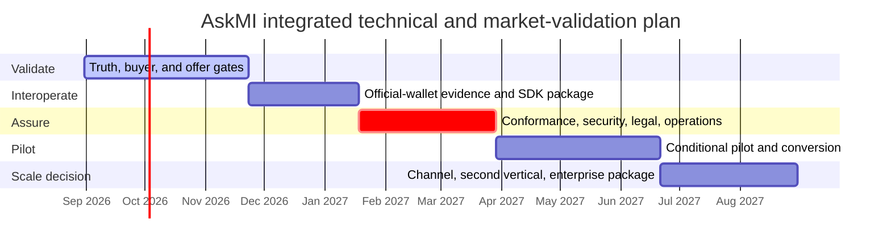

# AskMI go-to-market and pilot-validation sprint roadmap

**Status:** Active planning baseline  
**Baseline date:** 2026-08-30  
**Cadence:** 26 two-week sprints, 2026-08-31 through 2027-08-29  
**Live GTM tracker:** [GitHub issue #143](https://github.com/Late-bloomer420/miTch/issues/143)  
**Technical/readiness tracker:** [GitHub issue #142](https://github.com/Late-bloomer420/miTch/issues/142)  
**Technical roadmap:** [RELEASE_READINESS_ROADMAP.md](RELEASE_READINESS_ROADMAP.md)  
**Baseline candidate:** [Pull request #141](https://github.com/Late-bloomer420/miTch/pull/141)

> This is an evidence-gated operating plan, not a certification, compliance, production-readiness, customer, revenue, or European Commission endorsement claim. Commercial targets are hypotheses to test. A sprint closes only with linked evidence.

## Strategic decision

AskMI will enter the market as an **independent EUDI request-governance and evidence layer**, not as another wallet, generic verifier connector, identity provider, or age-verification vendor.

The commercial job is to help a relying party prove:

1. which business purpose justified a wallet request;
2. which minimum claims were permitted for that purpose;
3. which policy, trust source, registration scope, and software revision produced the decision;
4. whether a request changed after a rulebook, credential schema, wallet, or connector update; and
5. that the evidence path avoided retaining complete credential payloads where the selected architecture permits this.

The existing policy engine, deny reasons, audit/data-flow surfaces, OID4VP verifier components, and negative-test posture are useful inputs. They do not by themselves prove official-wallet interoperability, legal compliance, certification, production readiness, or market demand.

## Market hypothesis

| Dimension | Initial hypothesis |
|---|---|
| Economic buyer | Head of Digital Identity, EUDI Product Owner, Security/IAM leader, Privacy Engineering lead, or CTO at an integrator/service platform |
| Technical champion | IAM architect, identity engineer, privacy engineer, or security architect |
| Preferred scale channel | DACH IAM, digital-identity, and systems integrators |
| Reference vertical | DACH travel and hospitality |
| First journey | Purpose-bound, data-minimised hotel pre-arrival/check-in |
| First paid offer | Four-to-six-week EUDI Request-Minimisation Readiness Sprint |
| Product path | Open Policy SDK → self-hosted Evidence Gateway → enterprise support/adapters |
| Demonstration use case | 18+ proof; it is not the core category |
| Primary competitor | Internal build using official/open-source verifier components plus policy/configuration work |
| Principal risk | Connector and protocol plumbing becomes commoditised before AskMI proves an independent governance/evidence need |

Travel/hospitality is a founder-advantaged discovery wedge, not an assumed customer network. The buyer and budget owner must be demonstrated through interviews and paid work.

## Market and standards anchors

- [EU Digital Identity Regulation](https://digital-strategy.ec.europa.eu/en/policies/eudi-regulation)
- [Consolidated eIDAS text and relying-party registration rules](https://eur-lex.europa.eu/legal-content/EN/TXT/HTML/?uri=CELEX%3A02014R0910-20241018)
- [EC Relying Party Engagement Programme](https://ec.europa.eu/digital-building-blocks/sites/spaces/EUDIGITALIDENTITYWALLET/pages/978681884/Relying%2BParty%2BEngagement%2BProgramme)
- [APTITUDE travel/hospitality pilots](https://aptitude.digital-identity-wallet.eu/news/aptitude-at-eudiw-unfold-3-from-vision-to-implementation/)
- [Official EUDI verifier reference](https://github.com/eu-digital-identity-wallet/eudi-web-verifier)
- [OpenID4VP 1.0](https://openid.net/specs/openid-4-verifiable-presentations-1_0.html)
- [OpenID4VCI 1.0](https://openid.net/specs/openid-4-verifiable-credential-issuance-1_0.html)
- [OpenID conformance testing](https://openid.net/openid4vp-and-openid4vci-conformance-tests-are-complete-and-open-for-self-certification/)

These anchors justify timing and test scope. They do not establish AskMI readiness.

## Product and offer boundary

### Open Policy SDK

Initial public surface:

- OID4VP/DCQL request linting;
- purpose-to-minimum-claim recipes;
- deterministic fail-closed deny reasons;
- request/policy simulator and negative test vectors;
- official-verifier and walt.id adapter examples; and
- a reference travel/hospitality claim-minimisation profile.

### Self-hosted Evidence Gateway

Paid candidate surface:

- approved-purpose and request registry;
- policy approval, versioning, and rollback;
- request/schema/connector drift detection;
- connector-independent policy enforcement;
- PII-minimised decision records containing request hash, policy version, trust/registration decision, result, and deny reason;
- retention and export controls; and
- evidence reports for privacy, security, procurement, and change review.

Raw credentials and customer identity data are outside the evidence record by default. Any deployment that cannot maintain that boundary requires explicit architecture, privacy, retention, and legal review.

### Readiness Sprint

A four-to-six-week paid engagement for one journey:

1. map purpose, actors, data flow, legal assumptions, and current identity path;
2. identify necessary and excessive claims;
3. configure one policy and test-environment wallet flow;
4. produce an interoperability/minimisation evidence pack; and
5. deliver a gap register, pilot conditions, stop conditions, and next decision.

It must not be sold as certification, legal approval, EUDI conformance, or production readiness.

### Explicitly deferred

- leading with a proprietary wallet or issuer platform;
- competing as a generic all-wallet connector;
- a standalone age-verification business;
- broad EHDS, advertising, student, and travel delivery in parallel;
- blockchain/anchoring or post-quantum cryptography as the sales message;
- managed processing of raw credentials before customer demand and privacy architecture justify it; and
- paid advertising before repeatable buyer/problem evidence exists.

## Pricing hypotheses

These prices are discovery hypotheses and must be tested.

| Offer | Initial test range |
|---|---:|
| Readiness Sprint | €12,000–€25,000 |
| First two design-partner sprints | €7,500–€12,000 only for agreed evidence/case-study value |
| Self-hosted pilot | €1,500–€3,000 per month |
| Annual base licence | €18,000–€36,000 |
| Enterprise governance/support | €40,000–€90,000 per year |
| Proprietary adapter/integration | separately scoped |

Do not begin with per-verification pricing. AskMI is testing whether customers pay for governance, faster approval, and auditable evidence—not commodity transport.

## Work tracks

| Track | Scope | Gate rule |
|---|---|---|
| T — Technical truth | protocol, trust, adapters, interop, tests | governed by #142; exact revision/version evidence required |
| M — Market validation | interviews, buyer, offer, pricing, pipeline | anonymised evidence and explicit pass/fail counts required |
| C — Customer delivery | readiness engagements and conditional pilots | no live pilot before G4 |
| A — Assurance/operations | security, privacy, legal scope, runbooks | unresolved critical/high findings block G4 |
| O — Operating system | sprint review, decisions, WIP, metrics | one active sprint; missed gates trigger explicit re-plan |

Discovery and paid readiness/design work may run while technical work is incomplete. A live credential pilot may not bypass the technical, security, privacy, and operating gates.

## Programme gates and stop rules

| Gate | Date | Pass condition | If missed |
|---|---|---|---|
| G0 — Truth | 13 Sep 2026 | #141 merged/re-baselined; product boundary and permitted claims published; reproducible revision | Stop promotional launch; continue interviews with explicit prototype language |
| G1 — Buyer | 11 Oct 2026 | 20 interviews; ≥8 confirm problem; ≥3 identify budget owner/trigger/deadline | Stop broad build; change buyer, workflow, or category hypothesis |
| G2 — Offer | 22 Nov 2026 | Two design partners; ≥1 paid Readiness Sprint; signed scope/success measures | Do not build the full Gateway; re-test offer and urgency |
| G3 — Interop/package | 17 Jan 2027 | Frozen Android/iOS matrix; two adapter paths; measured unassisted quickstart | Keep work in readiness/testing; do not promise pilot integration |
| G4 — Conditional pilot | 31 Mar 2027 | #142 Waves 0–4, no P0/P1/high unresolved finding, legal/privacy scope and runbooks signed | Move date; no commercial waiver |
| G5 — Conversion | 20 Jun 2027 | ≥3 paying organisations, ≥1 annual conversion, repeated buyer/problem evidence | Stop vertical expansion; fix value, deployment, pricing, or channel |
| G6 — Year one | 29 Aug 2027 | Honest review against 5–8 paying organisations, two active channels, €200k–€400k exit-ARR target | Rebase next roadmap on evidence; do not relabel misses as traction |

Revenue and customer counts are planning targets, not forecasts.

## Phase-level timeline

## Sprint operating policy

- Cadence is Monday through Sunday for fourteen days.
- Only one sprint is active.
- Each sprint has one principal outcome, a small number of evidence-producing tasks, and an exit decision.
- Unfinished work is not silently carried over; it is re-estimated at review.
- Only the active and immediately upcoming sprint should be decomposed into implementation issues. This avoids a stale issue backlog.
- Market evidence in this public repository is anonymised. Never store prospect/customer names, personal contact details, confidential interview notes, contracts, or raw customer data here.
- A checked item requires a commit, test artifact, approved/signed artifact, or anonymised evidence link.
- A material standards/profile change invalidates affected evidence and can move dependent sprint dates.

# Complete sprint plan

## S00 — Repository truth and category lock

**Window:** 31 August–13 September 2026  
**Primary outcome:** one truthful baseline and one commercial category.

- [ ] **T:** resolve or explicitly re-baseline #141; preserve the exact tested revision and remaining limitations.
- [ ] **T:** remove/qualify unsupported “certified”, percentage-complete, production-ready, and absolute “never PII” language.
- [ ] **M:** publish the category hypothesis, buyer hypothesis, first hospitality journey, and explicit non-goals.
- [ ] **M:** build a 100-account research list, select 30 Tier-1 accounts, and send ten interview requests.
- [ ] **M:** contact/register for the EC travel/hospitality relying-party session on 18 September.
- [ ] **O:** publish an interview script and anonymised scoring sheet.

**Exit:** G0 decision recorded in #143. No product-launch claim is allowed if G0 fails.

## S01 — First discovery cohort and linter skeleton

**Window:** 14–27 September 2026  
**Primary outcome:** first direct problem evidence plus a narrow technical demonstration.

- [ ] **M:** complete ten interviews: target four hospitality/service operators, three integrators, and three identity/privacy/security owners.
- [ ] **M:** capture workflow, current solution, consequence of failure, buyer, budget trigger, timing, and alternatives.
- [ ] **M:** attend/use the 18 September EC session as a learning and relationship channel; do not imply programme membership.
- [ ] **T:** implement a DCQL/OID4VP request-linter skeleton against fixed example requests.
- [ ] **T:** draft the Evidence Capsule schema: request hash, purpose, policy version, trust/registration result, decision, deny reason, timestamp, software revision.
- [ ] **O:** review whether “governance/evidence” language matches customer vocabulary.

**Exit:** ten interviews, at least five credible problem confirmations, rerunnable linter examples, and a revised hypothesis log.

## S02 — Buyer and workflow validation

**Window:** 28 September–11 October 2026  
**Primary outcome:** prove or reject the buyer/problem combination.

- [ ] **M:** complete the second ten interviews and reach the 20-interview minimum.
- [ ] **M:** choose one economic buyer, one technical champion, and one concrete hospitality workflow.
- [ ] **M:** test Readiness Sprint pricing and procurement path without discounting to zero.
- [ ] **T:** map the chosen purpose to the minimum permitted claims and explicit rejected excess claims.
- [ ] **T:** complete an official-verifier adapter spike in a test environment.
- [ ] **O:** publish the G1 evidence summary using anonymised counts.

**Exit:** G1 passes only with ≥8 problem confirmations and ≥3 budget/procurement/deadline signals. Otherwise pause broad development and revise the hypothesis.

## S03 — Paid offer and current-protocol slice

**Window:** 12–25 October 2026  
**Primary outcome:** a sellable, bounded engagement backed by a revision-bound demo.

- [ ] **M:** create the Readiness Sprint statement of work, deliverables, exclusions, success criteria, and price range.
- [ ] **M:** qualify at least three opportunities and schedule proposal reviews.
- [ ] **T:** deliver the first fail-closed OpenID4VP 1.0/DCQL slice required by the selected journey.
- [ ] **T:** create one allowed and one deliberately excessive hospitality request profile.
- [ ] **A:** publish a data-flow and retention boundary for the demonstration.
- [ ] **O:** record the exact demo revision and known gaps.

**Exit:** three qualified opportunities, a bounded offer, and a testable purpose-to-claims demo.

## S04 — Interoperability evidence and proposals

**Window:** 26 October–8 November 2026  
**Primary outcome:** external test evidence and explicit commercial decisions.

- [ ] **M:** submit/review at least three paid proposals.
- [ ] **M:** use the 29–30 October EUDI Launchpad if admitted; otherwise run and publish an equivalent remote test plan without implying participation.
- [ ] **T:** record the first official-wallet or official-reference interop attempt with exact versions, configuration, results, and deviations.
- [ ] **T:** publish Request Minimisation Benchmark v0 for common journey requests; distinguish facts from policy assumptions.
- [ ] **A:** classify failures as product defect, unsupported profile, configuration, or external dependency.
- [ ] **O:** update scope/dates from observed evidence.

**Exit:** three proposal decisions and one reproducible external-interop report, successful or not.

## S05 — Design-partner close and policy registry

**Window:** 9–22 November 2026  
**Primary outcome:** paid demand plus the minimum governance control plane.

- [ ] **M:** close two design partners, including at least one paid Readiness Sprint.
- [ ] **C:** sign scope, actors, success measures, data boundary, confidentiality handling, and stop conditions.
- [ ] **T:** implement the approved-purpose/request registry with versioning and explicit default deny.
- [ ] **T:** bind a policy decision to purpose, minimum claim set, trust/registration inputs, and software revision.
- [ ] **T:** export a sample PII-minimised evidence report.
- [ ] **O:** record G2 without placing confidential customer details in public GitHub.

**Exit:** G2. If unpaid interest is the only signal, stop the full Gateway build and revisit urgency/value.

## S06 — Android interop and paid-sprint kickoff

**Window:** 23 November–6 December 2026  
**Primary outcome:** one real readiness engagement and Android evidence.

- [ ] **C:** conduct the paid-sprint kickoff and map one existing customer journey without copying customer PII into the repository.
- [ ] **C:** agree the legal-assumption register and identify the customer's responsible legal/privacy owner.
- [ ] **T:** run the frozen official Android wallet/core matrix required by #142.
- [ ] **T:** record same-device/cross-device, expiry, denial, over-request, replay, and trust-failure outcomes.
- [ ] **A:** link every reported result to exact tags, SHA, device/OS, configuration, and artifact.
- [ ] **O:** decide which gaps block the customer deliverable.

**Exit:** signed engagement evidence, current-state map, and Android matrix report.

## S07 — iOS interop and hospitality profile

**Window:** 7–20 December 2026  
**Primary outcome:** cross-platform evidence and a jurisdiction-bounded claim profile.

- [ ] **T:** run the frozen official iOS wallet/core matrix required by #142.
- [ ] **T:** record registration-validation configuration and keep access-certificate identity separate from registration identity in evidence.
- [ ] **C:** produce the first hospitality purpose/claim profile with explicit country/legal assumptions.
- [ ] **C:** start the second design-partner engagement if G2 passed.
- [ ] **A:** review whether any raw PID reaches downstream systems and document containment options.
- [ ] **O:** update the gap register and plan only evidence-backed fixes.

**Exit:** iOS matrix result, reviewed claim profile, and explicit remaining legal/technical gaps.

## S08 — Evidence consolidation and standards drift review

**Window:** 21 December 2026–3 January 2027  
**Primary outcome:** clean evidence and a controlled post-holiday baseline.

- [ ] **T:** consolidate Android/iOS/reference-verifier artifacts and remove stale or duplicate claims.
- [ ] **T:** compare the locked source baseline with current official releases; map material changes.
- [ ] **C:** prepare an interim Readiness Sprint findings pack.
- [ ] **A:** check that evidence records contain no credential payloads or customer-confidential material.
- [ ] **O:** prune backlog items that do not serve G3/G4.
- [ ] **O:** avoid broad feature work during the reduced-capacity window.

**Exit:** one current evidence index, a drift decision, and a re-prioritised G3 backlog.

## S09 — SDK and adapters release candidate

**Window:** 4–17 January 2027  
**Primary outcome:** a narrowly consumable package that a new integrator can test.

- [ ] **T:** package the Policy SDK, request linter, policy recipes, simulator, and evidence schema.
- [ ] **T:** complete test paths for the official verifier and walt.id adapter.
- [ ] **T:** publish a self-hosted quickstart and secure defaults.
- [ ] **C:** observe a design partner or independent tester completing the quickstart without source modification.
- [ ] **M:** measure time-to-first-valid-request and capture blockers.
- [ ] **A:** publish supported, legacy, rejected, and unimplemented profile matrices.

**Exit:** G3 requires the frozen Android/iOS matrix, both adapter paths, and measured unassisted activation. A demo-only pass is insufficient.

## S10 — Conformance scope and first Readiness Sprint outcome

**Window:** 18–31 January 2027  
**Primary outcome:** exact conformance scope plus a completed customer decision artifact.

- [ ] **T:** write the Implementation Conformance Statement for the frozen AskMI role/profile.
- [ ] **T:** run applicable FCAF and OpenID protocol tests; mark non-applicable tests honestly.
- [ ] **C:** deliver the first Readiness Sprint findings, gap register, and conditional next-step proposal.
- [ ] **M:** request a paid pilot/annual decision; do not substitute praise for commitment.
- [ ] **A:** scope an independent security/cryptographic review.
- [ ] **O:** compare actual delivery cost with price.

**Exit:** revision-bound test results, signed/acknowledged customer deliverable, and a commercial next decision.

## S11 — Evidence Gateway MVP

**Window:** 1–14 February 2027  
**Primary outcome:** the smallest self-hosted governance/evidence product.

- [ ] **T:** implement approved-purpose/request registry, policy approvals, versioning, rollback, and decision records.
- [ ] **T:** add request/schema/policy drift detection.
- [ ] **T:** enforce retention defaults and exclude raw credential payloads from the evidence record.
- [ ] **T:** provide customer-side deployment and backup/restore instructions.
- [ ] **C:** validate the workflow with design partners in non-production/test conditions.
- [ ] **A:** update threat model and privacy data flow.

**Exit:** Gateway MVP passes its defined security, retention, upgrade, and rollback acceptance tests.

## S12 — Security and operational hardening

**Window:** 15–28 February 2027  
**Primary outcome:** known risks are independently reviewed and operationally owned.

- [ ] **A:** begin/complete the independent security and cryptographic review as scheduled.
- [ ] **T:** triage and fix findings according to severity without hiding deferred risk.
- [ ] **A:** exercise key/session, monitoring, incident, vulnerability, rollback, and backup/restore runbooks.
- [ ] **C:** prepare a conditional pilot architecture and support model.
- [ ] **M:** submit pilot proposals only with unresolved limitations disclosed.
- [ ] **O:** assign named owners and due dates to every G4 blocker.

**Exit:** no unknown/untriaged finding and a complete, owner-bound G4 blocker list.

## S13 — Legal/privacy scope and conditional pilot contract

**Window:** 1–14 March 2027  
**Primary outcome:** a pilot that is legally, operationally, and commercially bounded.

- [ ] **A:** complete legal/privacy review for the actual actors, country, claims, retention, processors, and user communication.
- [ ] **C:** agree pilot users, environment, data, duration, support, success metrics, stop conditions, and exit criteria.
- [ ] **C:** sign a pilot scope that remains conditional on G4.
- [ ] **T:** close or explicitly disposition security findings and interoperability deviations.
- [ ] **M:** prepare customer-facing language that avoids certification/production claims.
- [ ] **O:** update the go/no-go dossier.

**Exit:** signed conditional scope plus written legal/privacy and operational responsibilities.

## S14 — Full gate rehearsal

**Window:** 15–28 March 2027  
**Primary outcome:** a reproducible go/no-go package, not more features.

- [ ] **T:** rerun clean-checkout, Android/iOS, FCAF/OpenID, negative, deployment, and rollback evidence on the candidate revision.
- [ ] **A:** exercise incident, trust outage, revocation, recovery, deletion/reporting, and support scenarios.
- [ ] **A:** verify no open P0/P1 or unresolved high-severity finding.
- [ ] **C:** conduct the customer/owner pilot-readiness review.
- [ ] **O:** freeze scope and publish the written recommendation.
- [ ] **O:** accept no new feature work unless it closes a gate blocker.

**Exit:** complete G4 dossier with explicit go/no-go recommendation and linked evidence.

## S15 — Conditional pilot decision and controlled start

**Window:** 29 March–11 April 2027  
**Primary outcome:** an honest 31 March decision and, only if approved, a controlled pilot start.

- [ ] **O:** record the 31 March G4 decision in #142 and #143.
- [ ] **O:** if no-go, publish blockers, owners, and the moved date; do not waive the gate.
- [ ] **C:** if go, deploy the limited pilot exactly within signed scope.
- [ ] **T:** confirm deployment maps to the tested revision and approved configuration.
- [ ] **A:** activate monitoring, support, incident, privacy, and stop-condition ownership.
- [ ] **M:** communicate pilot status without implying production availability.

**Exit:** G4 decision plus either a traceable controlled pilot or a transparent re-plan.

## S16 — Pilot observation and issue triage

**Window:** 12–25 April 2027  
**Primary outcome:** observed operational and user evidence.

- [ ] **C:** measure activation, request success/deny reasons, operator effort, and journey completion.
- [ ] **C:** interview operators/users under the approved research/privacy process.
- [ ] **T:** detect policy/request/schema drift and classify false allow/deny signals.
- [ ] **A:** review logs/evidence for retention, correlation, or support-process failures.
- [ ] **O:** triage issues by safety, value, and conversion impact.
- [ ] **M:** avoid public case-study claims until evidence and customer approval exist.

**Exit:** pilot evidence report, ranked fixes, and confirmation that stop conditions were not breached.

## S17 — Pilot iteration and conversion proposal

**Window:** 26 April–9 May 2027  
**Primary outcome:** fix the highest-value defects and ask for a commercial continuation.

- [ ] **T:** fix only evidenced high-impact pilot defects and rerun affected gates.
- [ ] **C:** deliver the agreed pilot evidence/findings report.
- [ ] **M:** submit annual/self-hosted continuation proposal with measured value.
- [ ] **M:** request an approved reference or anonymised case study; respect refusal.
- [ ] **A:** update risk and limitations statements.
- [ ] **O:** decide whether the journey is repeatable enough for another pilot.

**Exit:** explicit renew/convert/stop decision and refreshed evidence for every changed component.

## S18 — Second and third pilot acquisition

**Window:** 10–23 May 2027  
**Primary outcome:** test whether the value repeats outside the first relationship.

- [ ] **M:** approach ten qualified accounts using approved evidence, not broad cold spam.
- [ ] **M:** close or advance second/third paid pilot/readiness opportunities.
- [ ] **C:** reuse the standard journey and document every non-standard request.
- [ ] **T:** configure adapters/policies without customer-specific forks where possible.
- [ ] **O:** measure sales cycle, implementation effort, objections, and scope variance.
- [ ] **A:** reject deployments that require bypassing G4 controls.

**Exit:** two additional signed/qualified paying paths or a documented repeatability failure.

## S19 — Self-host deployment and first annual conversion

**Window:** 24 May–6 June 2027  
**Primary outcome:** prove deployability and convert the first pilot.

- [ ] **T:** harden packaging, configuration validation, upgrade, rollback, health, and support diagnostics.
- [ ] **C:** complete one customer-side/self-hosted deployment rehearsal.
- [ ] **M:** close the first annual contract or record the exact blocking decision.
- [ ] **M:** test the proposed annual price against delivered value and procurement.
- [ ] **A:** ensure customer deployment preserves the evidence/PII boundary.
- [ ] **O:** calculate delivery margin and founder/support load.

**Exit:** first annual conversion plus a reproducible deployment runbook, or an explicit conversion-gap diagnosis.

## S20 — Repeatability and conversion gate

**Window:** 7–20 June 2027  
**Primary outcome:** decide whether AskMI has an early repeatable business.

- [ ] **M:** reach or honestly assess the target of three paying organisations.
- [ ] **M:** confirm at least one annual conversion and two credible continuation paths.
- [ ] **M:** compare repeated buyer, trigger, objection, value, and deployment patterns.
- [ ] **T:** identify which product work is reusable versus services-only.
- [ ] **O:** record G5 with pipeline, revenue, cost, and conversion evidence.
- [ ] **O:** if G5 fails, stop vertical expansion and prioritise the diagnosed bottleneck.

**Exit:** G5 pass/fail and an explicit scale, repair, or narrow decision.

## S21 — Integrator channel enablement

**Window:** 21 June–4 July 2027  
**Primary outcome:** one partner can position and deliver AskMI without distorting its claims.

- [ ] **M:** qualify and onboard up to two identity/IAM/system-integrator relationships.
- [ ] **M:** agree target accounts, responsibilities, commercial model, and lead ownership.
- [ ] **T:** publish partner architecture, adapter, test, and troubleshooting material.
- [ ] **A:** provide permitted-claims and evidence-language guidance.
- [ ] **C:** support one partner-led discovery or implementation.
- [ ] **O:** measure whether the partner creates a qualified opportunity.

**Exit:** at least one active partner-sourced opportunity; logo-only partnerships do not count.

## S22 — Evidence-based second-vertical decision

**Window:** 5–18 July 2027  
**Primary outcome:** choose at most one adjacent vertical, or deliberately stay focused.

- [ ] **M:** score e-sign/QTSP, telecom, and fintech using inbound demand, regulation, buyer access, reuse, sales cycle, and competitive intensity.
- [ ] **M:** conduct targeted validation interviews only where evidence supports expansion.
- [ ] **T:** estimate incremental profiles/adapters and assurance scope.
- [ ] **A:** identify new legal/privacy/trust obligations.
- [ ] **O:** publish a choose/defer/reject decision.
- [ ] **O:** create no second-vertical feature unless a buyer and gate are named.

**Exit:** one evidence-backed decision, not three simultaneous roadmaps.

## S23 — Enterprise package and procurement readiness

**Window:** 19 July–1 August 2027  
**Primary outcome:** remove repeatable enterprise buying friction.

- [ ] **M:** finalise licence, support/SLA tiers, adapter pricing, and services boundary.
- [ ] **A:** prepare security questionnaire, architecture, privacy/data-flow, retention, subprocessors, vulnerability, and continuity pack.
- [ ] **T:** standardise configuration validation, environment separation, support bundle, and evidence export.
- [ ] **C:** validate the package with an active customer/partner procurement path.
- [ ] **O:** track requested certifications; begin only those repeatedly required and economically justified.
- [ ] **M:** avoid claiming certifications that are merely planned.

**Exit:** a reusable enterprise/procurement pack accepted as complete enough by at least one real buyer process.

## S24 — Renewal and pipeline conversion

**Window:** 2–15 August 2027  
**Primary outcome:** convert evidence into retained customers and a credible next-year pipeline.

- [ ] **M:** close, renew, or explicitly disposition all active pilot/proposal decisions.
- [ ] **M:** obtain approved references/case studies where available.
- [ ] **C:** review customer health, support load, deployment status, and next value.
- [ ] **T:** prune roadmap items that lack repeated customer or assurance value.
- [ ] **O:** calculate ARR, services revenue, gross-margin proxy, pipeline coverage, and concentration risk.
- [ ] **O:** prepare G6 evidence.

**Exit:** no ambiguous “interested” opportunities counted as customers or revenue.

## S25 — Year-one review and next roadmap

**Window:** 16–29 August 2027  
**Primary outcome:** an evidence-based next strategy.

- [ ] **O:** record G6 against the planning targets of 5–8 paying organisations, two active channels, and €200k–€400k exit ARR.
- [ ] **O:** compare actual buyer, problem, product, pricing, channel, sales cycle, delivery cost, and technical risk with the baseline hypotheses.
- [ ] **T:** refresh official EUDI source/profile locks and invalidate affected stale evidence.
- [ ] **M:** choose the next-year focus: deepen, change channel, change vertical, reposition, or stop.
- [ ] **O:** archive superseded assumptions without rewriting history.
- [ ] **O:** publish the next evidence-gated roadmap with named owners and capacity.

**Exit:** signed next-year decision and a clean, truthful programme baseline.

## Core metrics

### North star

Number of production or controlled-pilot relying-party journeys governed by AskMI with revision-bound evidence.

### Market

- interviews completed and confirmation rate;
- named economic-buyer rate;
- budget/procurement/deadline signal rate;
- qualified opportunity, paid sprint, pilot, and annual conversion;
- sales cycle, ACV, implementation cost, partner-sourced pipeline; and
- lost reasons.

### Product and trust

- time to first valid request;
- percentage of templates passing minimisation policy;
- false-allow and false-deny findings;
- interoperability matrix pass rate;
- request/schema/policy drift detected;
- exact-revision evidence coverage; and
- unresolved severity by gate.

### Operating constraints

- one active sprint;
- no silent carryover;
- no public customer/confidential data;
- no unsupported compliance/certification claim; and
- no live pilot before G4.

## Immediate next actions

1. Finish G0 on #141 and the current repository claims.
2. Create the anonymised interview script/scorecard.
3. Build the first 100-account research list outside the public repository; publish only counts and selection criteria.
4. Send ten interview requests.
5. Prepare for the EC travel/hospitality session on 18 September 2026.
6. Implement the narrow DCQL/OID4VP request-linter skeleton in S01.
