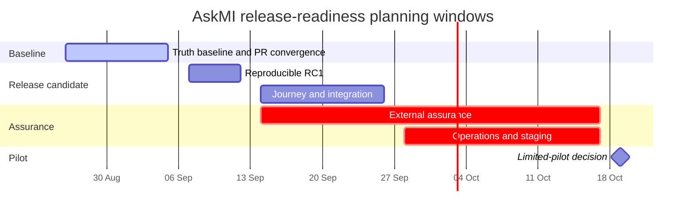

# AskMI release-readiness roadmap

**Status:** Active planning and gate-sequencing document  
**Last reconciled:** 2026-08-26  
**Live tracker:** [GitHub issue #142](https://github.com/Late-bloomer420/miTch/issues/142)  
**Baseline candidate:** [Pull request #141](https://github.com/Late-bloomer420/miTch/pull/141)

> AskMI remains development/evaluation software. The dates below are planning
> targets, not certification, production-readiness claims, or release promises.
> A gate moves only when its exit evidence exists.

## Role and authority

This document sequences the path from the current truth/readiness baseline to a
reproducible release candidate, a limited pilot, and a later production
decision. It does not duplicate detailed task or evidence records.

| Surface | Authority |
|---|---|
| [Issue #142](https://github.com/Late-bloomer420/miTch/issues/142) | Live gate checklist, decisions, and links to current evidence |
| [`BACKLOG.md`](BACKLOG.md) | Individual task state and priority |
| [`STATE.md`](../STATE.md) | Current operational snapshot |
| [`RELEASE_CANDIDATE_CHECKLIST.md`](RELEASE_CANDIDATE_CHECKLIST.md) | Reproducible RC evidence and known limitations |
| [`MATURITY_AND_LIMITATIONS.md`](MATURITY_AND_LIMITATIONS.md) | Product boundary and evidence language |
| [`docs/qa/`](qa/) | Dated, revision-bound internal validation records |
| [`REFACTORING_ROADMAP.md`](REFACTORING_ROADMAP.md) | Deferred architecture work, not automatically a release blocker |

When these surfaces drift, reconcile them using
[`DOCS_CANON.md`](DOCS_CANON.md). A plan or historical run does not close a
gate.

## Current position

As of 2026-08-26:

- PR #141 is the only coherent truth/readiness baseline candidate.
- Executable head `ffbc19e12307194919600a689d24caba16984614` is mergeable.
  Its latest build/test/lint, layer-validation, dependency-audit, and security
  workflow runs passed.
- The three #141 review threads have current-head reconciliation replies. They
  still require explicit maintainer resolution or acknowledgement before merge.
- The repository has no failure-gating real-browser E2E or container-start gate.
  The dated ADOPT live probe is not committed and therefore is not rerunnable.
- External security/cryptographic review and official EUDI
  interoperability/conformance evidence do not exist for the product as a
  whole.
- Production key management, distributed verifier-session storage, monitoring,
  incident response, privacy operations, and support ownership remain outside
  the current RC.

The immediate objective is therefore **RC0 truth consolidation**, not a
production release.

## Planning timeline

The production decision is deliberately absent from the chart. It becomes
schedulable only after the pilot and assurance gates have evidence.

## Gate A — truth baseline

**Target window:** 26–28 August 2026

### Exit evidence

- Every #141 review thread is explicitly resolved or dismissed against the final
  head.
- Required checks pass on the final head, with the exact SHA and date recorded.
- #141 merges without unrelated executable scope.
- #138 is closed as superseded by the reconciled ADOPT evidence.
- Issue #122 is closed as stale with links to the current enforcement map,
  negative regression coverage, `STATE.md`, and `BACKLOG.md`.
- Issue #95 is closed as superseded by the canonical AskMI naming decision.

**Result:** RC0 becomes the single repository truth baseline. This still means
development/evaluation software.

## Gate B — PR and dependency convergence

**Target window:** 31 August–4 September 2026

### Open-PR disposition

| PR | Current state | Required disposition |
|---|---|---|
| [#141](https://github.com/Late-bloomer420/miTch/pull/141) | Mergeable; latest executable-head CI/security green | Resolve the three reconciled threads, confirm the final head, then merge as RC0 |
| [#140](https://github.com/Late-bloomer420/miTch/pull/140) | Changes requested; nominal PostCSS patch includes Vite 8 migration | Close after #141 lands; recreate only a PostCSS-only update if the version is still missing |
| [#138](https://github.com/Late-bloomer420/miTch/pull/138) | Documentation evidence already reconciled into #141 | Close as superseded after #141 merges |
| [#130](https://github.com/Late-bloomer420/miTch/pull/130) | Conflicted, five review threads, no workflow run on latest head | Do not merge wholesale; salvage the credential-pool bridge on current `master` after lifecycle, truth, governance, and CI gates |
| [#139](https://github.com/Late-bloomer420/miTch/pull/139) | Conflicted draft; mixed docs, wallet, and config scope; no head CI | Split only independently justified pieces into small current branches |
| [#129](https://github.com/Late-bloomer420/miTch/pull/129) | Conflicted UX branch with two review threads | Re-scope after the AskMI naming/product boundary; do not merge the stale branch wholesale |
| [#105](https://github.com/Late-bloomer420/miTch/pull/105) | Stale/conflicted; mixes useful fallback behavior with public-tunnel exposure | Decide the service-endpoint fallback separately; close without inheriting wildcard tunnel exposure by default |

### Dependency/runtime exit evidence

- PostCSS and Vite are reviewed as separate changes.
- Node and pnpm versions are pinned consistently for developer, CI, and
  container paths.
- Stale npm lockfiles are removed or explicitly quarantined; pnpm is documented
  as the install authority.
- No conflicted or stale PR is presented as merge-ready.

## Gate C — reproducible RC1

**Target window:** 7–11 September 2026

### Required work

1. Add failure-gating browser E2E for verifier request, wallet handoff,
   authorization, presentation, status polling, expiry, and retry using one
   session identifier.
2. Add container build/start smoke coverage for the wallet, verifier frontend,
   verifier backend, and required workspace packages.
3. Convert the live ADOPT probe into a committed, rerunnable gate.
4. Run the complete clean-checkout RC checklist against one exact revision.
5. Record residual warnings, low-severity advisories, skipped paths, and
   environment limits in the prerelease notes.
6. Create a GitHub prerelease only when every RC1 exit condition is evidenced.

### Exit criteria

| Control | Evidence required |
|---|---|
| Install reproducibility | Frozen install succeeds with the pinned package manager/runtime |
| Static and unit validation | Guards, build, tests, lint, layer validation, and high-severity audit pass |
| Browser behavior | Real-browser flow passes and failures block CI |
| Deployment shape | Containers build and start with health checks and required workspace dependencies |
| Traceability | Release artifact and notes identify the exact commit, date, and configuration |
| Truth boundary | Known limitations and external-validation gaps are copied into the prerelease |

## Gate D — pilot-grade journey and integration

**Target window:** 14–25 September 2026

Release-path work promoted from the backlog:

| Work package | Pilot exit behavior |
|---|---|
| G-110.2 / G-110.3 | Handoff state and request TTL are explicit, fail-closed, and retryable |
| G-120.1 / G-120.2 / G-120.3 | Popup, same-tab fallback, and cross-tab/session binding behave consistently |
| G-130.2 | Recovery/fallback UX has no unsafe bypass or unrecoverable dead end |
| G-140.2 | Success/failure result and return-to-verifier behavior are consistent |
| G-150.1 / G-150.2 | Reference verifier integration is documented, reproducible, and deny-biased |
| G-160.1 | Partner/verifier onboarding and trust-registry ownership are defined |

### Exit evidence

- A hosted staging environment uses explicit origin, key, trust, and retention
  configuration.
- The complete happy-path and failure-mode matrix passes in a real browser
  against staging.
- A new verifier integration follows the documented path without repository code
  changes or insecure defaults.
- Pilot scope, actors, data classes, and retention are frozen for assurance
  review.

## Gate E — assurance and operations

**Target window:** 14 September–16 October 2026

This gate may run in parallel with Gate D, but it cannot be waived by green
repository tests.

### Independent assurance

- Independent security and cryptographic review is complete; every finding has a
  disposition and evidence.
- External EUDI interoperability/conformance work covers the declared pilot
  profile.
- [Issue #97](https://github.com/Late-bloomer420/miTch/issues/97) stays open
  until the mdoc AV/ZKP gap is implemented, formally excluded from the release
  scope, or accepted by the relevant external evaluation.
- Legal/privacy review covers the actual deployment and data flows, not only the
  architecture documents.

### Operational readiness

- Deployment-appropriate key management, recovery, and rotation replace demo
  key handling.
- Verifier session state supports the intended deployment topology, or the pilot
  is explicitly constrained to one instance.
- Monitoring, alerting, incident response, backup/restore, privacy operations,
  rollback, and support ownership are tested and assigned.
- Issuer/verifier onboarding, trust-list governance, certificate lifecycle, and
  revocation availability have named owners and runbooks.

## Gate F — limited-pilot go/no-go

**Target decision:** 19 October 2026

A go decision requires all of the following:

- no open P0/P1 defect on the pilot path;
- no unresolved high-severity dependency or external-review finding;
- clean-checkout RC verification and deployed-artifact traceability;
- tested telemetry, incident, rollback, backup/restore, and support procedures;
- named owners for trust governance, privacy operations, and pilot support;
- explicit pilot scope, success metrics, stop conditions, and exit criteria; and
- a recorded go/no-go decision that does not describe the pilot as production
  readiness.

## Production gate — intentionally undated

Production becomes a decision only after:

1. pilot exit criteria are met and evidenced;
2. external security/cryptographic findings are closed or formally accepted;
3. the declared EUDI interoperability scope is validated or narrowed honestly;
4. key, session, trust, monitoring, incident, privacy, backup, rollback, and
   support controls operate in the target environment;
5. legal/privacy review covers that environment; and
6. release, change, vulnerability, and support ownership is durable.

Until then, marketing and documentation must continue to describe AskMI as
development/evaluation software.

## Update discipline

- Update issue #142 when a gate changes; link evidence instead of copying
  revisionless test totals.
- Update this roadmap when sequencing, gates, or release scope changes.
- Update `BACKLOG.md` for individual task state and `STATE.md` for operational
  facts.
- Store dated verification in `docs/qa/` with the tested revision and
  environment.
- Never close a gate from a plan, stale branch, historical local run, or
  internally produced compliance percentage.
