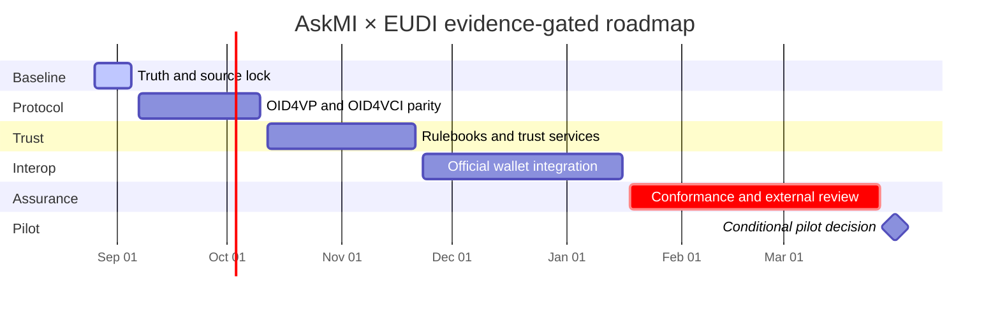

# AskMI × EUDI release-readiness roadmap

**Status:** Active, evidence-gated plan  
**Baseline date:** 2026-08-26  
**Live tracker:** [GitHub issue #142](https://github.com/Late-bloomer420/miTch/issues/142)  
**Baseline candidate:** [Pull request #141](https://github.com/Late-bloomer420/miTch/pull/141)  
**Official-source lock:** [EUDI source baseline](eudi/EUDI_SOURCE_BASELINE.md)

> AskMI is development/evaluation software. This roadmap does not claim EUDI certification, LoA High, production readiness, or European Commission endorsement. Dates are planning windows; a gate closes only with revision-bound evidence.

## Product decision

AskMI will not fork or replace the European Commission reference wallets. It will ship as policy/trust middleware and a verifier integration layer that interoperates with the official EUDI reference implementation. The repository's browser wallet remains a test/reference harness, not a certified EUDI Wallet Solution.

The public EC implementation is a multi-repository organization, not one monolithic "original wallet" repo. The primary mobile anchors are the official [Android wallet](https://github.com/eu-digital-identity-wallet/eudi-app-android-wallet-ui) and [iOS wallet](https://github.com/eu-digital-identity-wallet/eudi-app-ios-wallet-ui), backed by their official core libraries.

## Authority and evidence

| Surface | Authority |
|---|---|
| [EUDI source baseline](eudi/EUDI_SOURCE_BASELINE.md) | Official source/version lock and AskMI role boundary |
| This roadmap | Sequencing, gates, dependencies, and planning windows |
| [Issue #142](https://github.com/Late-bloomer420/miTch/issues/142) | Live checklist and current evidence links |
| [BACKLOG.md](BACKLOG.md) | Individual task state and priority |
| [STATE.md](../STATE.md) | Current operational snapshot |
| [RC checklist](RELEASE_CANDIDATE_CHECKLIST.md) | Clean-checkout release evidence |
| [Maturity and limitations](MATURITY_AND_LIMITATIONS.md) | Permitted product/evidence language |
| [docs/qa](qa/) | Dated, revision-bound validation records |

Internal tests establish implementation behavior only. They do not establish legal compliance, certification, external interoperability, or LoA High.

## Current implementation truth

| Area | Repository truth | Classification | Consequence |
|---|---|---|---|
| Policy mediation | Fail-closed policy engine, claim enforcement, audit/data-flow surfaces, negative tests | Implemented internally | Exercise through official-wallet interop |
| SD-JWT VC | Issuance, disclosure, key-binding, verification primitives | Internal; rulebook conformance unproven | Map exact PID/EAA rulebooks and official payloads |
| mdoc | CBOR/COSE, MSO, issuer/device auth, offline verification | Internal; official interop unproven | Add PID/mDL vectors, transport, reader-auth, status |
| OpenID4VP | Presentation Exchange / presentation_definition | Partial; current EC profile uses DCQL | Implement OpenID4VP 1.0 + DCQL; legacy must be explicit |
| OpenID4VCI | Custom/draft subset with offer, proof, issuance, batch | Partial; 1.0 not demonstrated | Align metadata, grants, nonce, deferred/notification, encryption, errors |
| HAIP/attestation | Custom verifier/client attestation helpers | Partial; current-profile equivalence unproven | Reconcile against current HAIP and official tests |
| Trust | JSON DID-list PoC and configurable anchor path | PoC; not ETSI LoTE/Trusted Lists | Add ETSI TS 119 602/119 612 and RP certificate validation |
| Status/revocation | Status-list prototypes and checks | Partial; profile coverage unproven | Validate signer, freshness, failure, privacy semantics |
| Identity/key seam | WebAuthn-backed path and identity guardian | Useful seam; not WSCA/WSCD certification | Keep browser claims narrow; rely on native wallet security |
| Issuer connection | eID connector simulated; national eID modes are stubs | Demo only | Exclude real PID issuance until a provider exists |
| Browser wallet | Complete demo journey and recovery controls | Reference harness | Use for CI/diagnostics, never certification claims |
| External evidence | No official-wallet interop, FCAF result, protocol result, or independent security review | Missing | Blocks pilot go/no-go |

## Claims correction

The June 2026 CIR matrix is a historical internal engineering checklist. Its "98%" total, LoA High row, hardware-binding row, and FCAF-readiness row are not conformance or certification evidence. Replace it with requirement-level traceability against the locked official baseline. Until then, no percentage may appear in release or marketing claims.

## Delivery timeline

Production is intentionally unscheduled.

## Wave 0 — truth, source lock, and repository convergence

**Target:** 26 August–4 September 2026

- Merge PR #141 after resolving current review threads and rerunning checks on the final head.
- Close/re-scope stale PRs using the disposition table below.
- Lock [ARF v3.0.0](https://github.com/eu-digital-identity-wallet/eudi-doc-architecture-and-reference-framework/releases/tag/v3.0.0) and exact official component tags.
- Replace the CIR percentage with traceability fields: requirement, source/version, AskMI role, implementation, test, external evidence, status, owner, review date.
- Freeze the pilot profile: AskMI verifier/middleware + official Android first; iOS parity before pilot.
- Pin Node/pnpm consistently and remove or quarantine stale npm lockfiles.

**Exit:** one canonical revision; no stale PR presented as merge-ready; dated source lock; consistent middleware/reference-harness wording; unsupported percentages marked historical.

## Wave 1 — current protocol parity

**Target:** 7 September–9 October 2026

### OpenID4VP 1.0 and DCQL

- Add DCQL parsing, validation, authorization, and minimal-disclosure mapping.
- Support official same-device/cross-device request and response profiles, request objects, nonce/state/session binding, and current response modes.
- Reject ambiguous negotiation and unsupported requests; preserve Presentation Exchange only behind an explicit legacy profile.
- Add replay, expiry, mix-up, redirect, downgrade, malformed-request, and over-disclosure tests.

### OpenID4VCI 1.0

- Align issuer/auth-server metadata, credential configurations/offers, authorization-code and pre-authorized-code grants, PKCE/PAR where applicable, nonce, proof, token, credential, batch, deferred, notification, encrypted response, and errors.
- Remove custom field names and draft assumptions at public boundaries.
- Add key binding, replay handling, and privacy-aware batch behavior.
- Run against the locked official issuer and official wallet-core examples.

### CI and exit evidence

- Add failure-gating browser E2E and container build/start smoke tests.
- Commit the ADOPT/live probe as a rerunnable gate.
- Publish a clean-checkout RC report for one exact SHA.
- Publish a profile matrix: supported, legacy, rejected, unimplemented.
- Record official issuer ↔ AskMI wallet/harness and AskMI issuer ↔ official wallet flows; no protocol claim rests only on unit tests.

## Wave 2 — credential rulebooks, trust, and registration

**Target:** 12 October–20 November 2026

### Credential profiles

- Implement exact current PID schemas for SD-JWT VC and mdoc and the mDL profile required by the pilot.
- Resolve issue #97 using rulebook-defined age semantics, not a repo-local claim shape.
- Validate namespaces, types, mandatory/optional attributes, metadata, validity, key binding, and disclosure.
- Define status/revocation per format and record dependencies on evolving ISO work.
- Defer AV/ZKP and additional attestations unless the frozen pilot requires them.

### Trust and relying-party services

- Replace the JSON DID-list PoC on the pilot path with ETSI TS 119 602 LoTE and/or ETSI TS 119 612 Trusted List processing required by the selected EC profile.
- Validate list signatures, anchors, service status, validity, rollover, revocation, cache expiry, network failure, and rollback.
- Validate relying-party access and registration certificates, registered scope, and intended use.
- Bind policy to trusted issuer, RP identity, registration scope, rulebook, and requested attributes.
- Create trust onboarding, suspension, revocation, incident, and outage runbooks.

**Exit:** requirement traceability for frozen PID/mDL profiles; negative tests for untrusted issuer/RP, excess scope, stale/revoked trust, and outages; dated trust ceremony/rollover/revocation evidence.

## Wave 3 — official EC wallet integration and pilot hardening

**Target:** 23 November 2026–15 January 2027

Integration order: official Android wallet/core, official iOS wallet/core, official EC issuer/verifier comparison anchors, then AskMI as verifier middleware/adapter—not a replacement wallet.

- Record exact tags/SHAs, profile, credential, device/OS, configuration, result, deviations, logs, and artifacts for every run.
- Complete handoff state, request TTL, popup/same-tab fallback, session binding, recovery, and return-to-verifier UX.
- Deliver verifier adapter/button and server middleware with deny-biased defaults.
- Establish hosted staging with explicit origins, keys, trust sources, retention, health checks, and artifact traceability.
- Run same-device, cross-device, expiry, retry, denial, partial-consent, revocation, trust-failure, and recovery paths.
- Include proximity only if transport, reader auth, status limits, and official-device evidence are ready.

**Exit:** Android and iOS official-wallet matrices pass; a new RP integrates without source changes or insecure defaults; browser wallet remains labelled as a harness.

## Wave 4 — conformance, assurance, and operations

**Target:** 18 January–26 March 2027

### Functional conformance

- Create an Implementation Conformance Statement for the exact AskMI role/profile.
- Run applicable tests from locked [FCAF v0.0.10](https://github.com/eu-digital-identity-wallet/eudi-doc-functional-conformance-assessment/releases/tag/v0.0.10) and archive results.
- Run applicable OpenID Foundation protocol conformance tests.
- Reuse/adapt the official [EUDI testing application](https://github.com/eu-digital-identity-wallet/eudi-doc-testing-application) for UI/device evidence.
- Record exclusions/failures; never convert non-applicable tests into coverage.
- State that FCAF is functional evidence, not security/privacy certification.

### Security, privacy, and operations

- Complete independent security/cryptographic review and disposition findings.
- Deploy production-grade key management, rotation, recovery, and separation.
- Implement session storage for the target topology.
- Review correlation/linkability, batch, RP impersonation, injection, replay, downgrade, recovery, and trust compromise.
- Exercise monitoring, incident/vulnerability response, backup/restore, rollback, privacy/deletion/reporting, and support runbooks.
- Complete legal/privacy review for actual pilot actors, data, jurisdiction, retention, processors, and user communications.

**Exit:** no unresolved critical/high finding; revision-bound FCAF/ICS/protocol results; exercised runbooks; signed pilot scope, owners, metrics, stop conditions, and exit criteria.

## Conditional limited-pilot gate

**Target decision:** 31 March 2027

A go decision requires Waves 0–4 with linked evidence; official Android/iOS interop; no P0/P1 or high unresolved finding; deployment traceability; exercised trust/key/session/ops/privacy/support controls; named owners; and a written decision that does not claim production readiness or Wallet Solution certification. Material official-profile changes move the date and invalidate affected evidence.

## Deferred/out of pilot scope

- becoming a certified EUDI Wallet Solution or claiming LoA High/WSCA/WSCD compliance;
- qualified electronic signatures, Digital Credentials API, wallet-to-wallet, backup/migration/multi-device continuity;
- ZKP/BBS+ and advanced anonymous credentials;
- national PID issuance through simulated eID connectors; and
- production launch.

## PR and issue disposition

| Item | Required action |
|---|---|
| PR #141 | Merge as truth/source-roadmap baseline after final review/checks |
| PR #140 | Separate PostCSS from the Vite 8/toolchain migration |
| PR #138 | Close as superseded after #141 |
| PR #130 | Salvage only independently reviewed credential-pool work |
| PR #139 | Split mixed scope onto current baseline |
| PR #129 | Re-scope UX after protocol/profile decisions |
| PR #105 | Close stale tunnel work; separately justify endpoint fallback |
| Issue #97 | Keep open until official age semantics are evidenced |
| Issue #122 | Close with current enforcement regression evidence |
| Issue #95 | Close as superseded by AskMI naming/product decision |

## Production gate — intentionally undated

Production becomes schedulable only after successful pilot exit plus durable governance, external assurance, interoperability, legal/privacy review, operational controls, and support. If AskMI becomes a Wallet Solution, it needs a separate certification programme; this roadmap neither grants nor predicts certification.

## Update discipline

- Update issue #142 when a gate changes; link evidence.
- Update the source baseline when an official dependency/profile changes.
- Update BACKLOG.md for task state and STATE.md for operational facts.
- Store dated verification in docs/qa with exact revisions/environment.
- Never close a gate from a plan, stale branch, internal percentage, or historical run.
