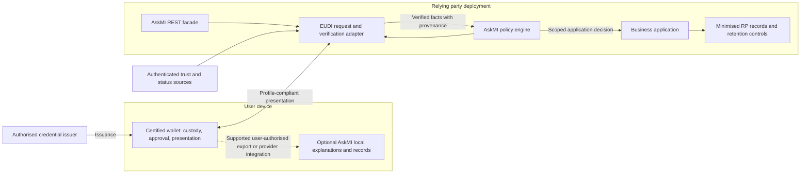

# miTch / AskMI: EUDI trust, architecture and certification assessment

Date: 11 September 2026. Author: Codex, acting as an external-style technical reviewer.

Status: independent desk assessment and proposed roadmap; **not an accredited audit, certification, legal opinion or production approval**. No certification body or regulator participated. This report does not establish that every applicable EU or national obligation has been assessed.

Repository: `C:\Users\Lenovo\.aaCoding\miTch`.
Reviewed commit: `a4601c6a8a264d24f4da58d96396ecff6da85e77`.
Active branch: `docs/adopt-0ab-live-verification`; initially clean. This is the inspected checkout, not an assertion about current remote master or deployed services.

## 1. Goal and decision

The goal is to find a viable architecture that lets AskMI mediate identity and attribute use at the edge without silently replacing issuer trust, bypassing wallet control, or claiming certification it does not have. Scope includes multiple use cases, both middleware and a separately certified wallet, user approval, credential movement, and an implementation roadmap. No Member State was selected; national certification and sector-specific deployment clearance remain open gates.

**Recommendation: first build AskMI as software deployed within a relying party's environment, using existing certified EUDI wallets. Add a wallet-provider integration later if a provider accepts AskMI inside its assessed boundary. Do not make an independently certified AskMI wallet the first product.**

The existing implementation has useful policy, credential and verification building blocks. It does **not** supply enough evidence to claim EUDI conformity, assurance level High, or readiness for the EU Wallet Trust Mark. Several reviewed paths have concrete security and interoperability gaps. A passing demo is evidence of a demo, not of cross-border trust.

The production boundary should be:

> Certified wallet controls the credential and presentation keys. The relying party validates the original evidence. AskMI limits requests and governs the relying party's processing. An AskMI decision is explicitly an application decision, never a replacement government credential.

This is a proposed architecture, not a claim that the current code already implements it. This change adds the report only; implementation and product claims need the work below.

## 2. Rulebook and evidence hierarchy

Binding EU law takes precedence over architectural guidance. Applicable national schemes and sector rules add requirements. ARF requirements, credential rulebooks and pinned protocol profiles guide implementation; discussion papers and reference code are not certificates.

| Baseline inspected                                                                       | Consequence for this assessment                                                                                                                                                                                                                        |
| ---------------------------------------------------------------------------------------- | ------------------------------------------------------------------------------------------------------------------------------------------------------------------------------------------------------------------------------------------------------ |
| eIDAS amended by Regulation 2024/1183, especially Articles 5a, 5b and 5c                 | Wallet provision, user control, relying parties and certification are different responsibilities. [S1]                                                                                                                                                 |
| Implementing Regulations 2024/2977, 2979, 2980 and 2982, through amendment **2026/1731** | The original 2024 technical baseline is insufficient. The amendment is in force; registration-certificate validation under amended 2982 Article 3(4) has a specific 11 August 2028 application date. Do not defer all wallet duties to that date. [S2] |
| 2024/2981                                                                                | National wallet certification schemes cover the solution and operating environment, not just cryptographic algorithms. [S3]                                                                                                                            |
| 2025/848 and **2026/1730**                                                               | RP registration, service identity, certificates and intermediary association must enter the deployment design. [S4] [S5]                                                                                                                               |
| ARF **3.0.0**, upstream release commit `c64f2cbb19aee37c571c58af66d359c4d5be29c8`        | Current inspected architecture baseline. Includes RP Services, updated trust infrastructure and FCAF. Older 2.8 material was used for comparison, not as the current baseline. [S6]                                                                    |
| GDPR                                                                                     | Lawful processing, minimisation, transparency, retention and special-category conditions remain separate from successful cryptography. [S7]                                                                                                            |
| RFC 9901 and OpenID4VP 1.0                                                               | Selective disclosure and presentation validation must match their selected EUDI profiles. Generic JWT support is insufficient. [S8] [S9]                                                                                                               |

The July amendment also introduces portrait-specific safeguards and updated technical profiles. Build an applicability register with separate fields for publication, entry into force, deferred application, affected role and test evidence. An ARF release alone must not silently change production acceptance policy. [S2]

Operational scoping must also include wallet security-breach handling under 2025/847 and, if issuing qualified or public-source attestations, 2025/1569. Those were identified but not exhaustively assessed here. [S10] [S11]

## 3. What “the same level of trust” actually means

Trust is not a flag attached to a JSON object. For the proposed production profile, it is a conjunction of independently checked properties:

1. The issuer is authorised for the specific credential type and role.
2. The issuer signature and every disclosed value are valid.
3. The appropriate holder/device binding remains intact.
4. The presentation belongs to this relying party, request and fresh transaction.
5. Credential, certificate and relevant wallet status meet the profile's validity rules.
6. The credential semantics and legal category fit the intended decision.
7. Disclosure and subsequent processing have the required authorisation and legal basis.

These are proposed acceptance conditions derived from the trust model, not a claim that every credential has identical binding requirements. PID, QEAA, public-source EAA and ordinary EAA must remain distinguishable. An ordinary EAA can be useful without inheriting a government's or qualified provider's status. [S12] [S13]

### Credential operations

| Operation                                                                              | Trust outcome and recommended treatment                                                                                                              |
| -------------------------------------------------------------------------------------- | ---------------------------------------------------------------------------------------------------------------------------------------------------- |
| Forward an unchanged presentation to its intended verifier inside the same transaction | Can preserve evidence. Keep original issuer bytes, disclosed values and holder proof. Still validate audience, nonce, recipient, status and profile. |
| Select issuer-supported disclosures                                                    | Supported mechanism. Preserve the signed payload and validate disclosure digests. Do not rename signed claims in transit. [S8]                       |
| Normalise verified claims into an internal application model                           | Useful and permitted as processing when lawful. Preserve provenance and mark the normalised result as an application representation.                 |
| Turn a disclosed birth date into a local `age >= 18` decision                          | The application can calculate it, but this is the application's decision. The calculation does not create an issuer-signed age predicate.            |
| AskMI signs a new Boolean and sends it elsewhere                                       | The receiver now relies on AskMI's computation and controls. Do not advertise this as unchanged issuer evidence or an equivalent QEAA/PID.           |
| Change a signed claim, issuer, expiry, holder key or credential type                   | Invalidates the original signature or its meaning. Obtain a new credential from the appropriate issuer.                                              |
| Convert SD-JWT into an AskMI-signed mdoc or BBS credential                             | Re-issuance under a different trust relationship, not transparent format conversion. No production equivalence assumption.                           |
| Copy a credential to a new device or wallet                                            | Bytes alone do not transfer device-bound presentation capability. Use the wallet/issuer's supported migration or re-issuance procedure.              |
| Reuse a presentation at a different service                                            | Reject under the proposed profile; request a new presentation for the actual recipient.                                                              |
| Combine identity and professional credentials                                          | Validate both and establish the required same-person relationship; two valid credentials in one bundle are not sufficient by themselves.             |

RFC 9901 preserves issuer authenticity through salted disclosure digests and can bind presentations to a holder key. It does not provide a general arithmetic proof system over hidden claims. [S8]

Prefer an issuer-issued threshold or entitlement attribute where available. A supported ZKP scheme could provide a different solution, but would require a precise issuer-evidence relation, binding, freshness, status, interoperable profile and accepted assurance argument. The linked EUDI TS4 document explicitly discusses candidates and limitations; its title is not evidence that arbitrary custom ZKPs are accepted. Keep this work outside the first production acceptance path. [S14]

Portability/export has a separate EUDI specification. An exported history or credential representation must not be confused with a transferable right to use protected keys. Use TS10 for user-controlled records and the actual wallet/issuer lifecycle for usable credentials. [S15]

## 4. Compare the product routes

| Route                                           | Trust boundary                                                                     | Main obligations and cost drivers                                                                                      | Verdict                                                                          |
| ----------------------------------------------- | ---------------------------------------------------------------------------------- | ---------------------------------------------------------------------------------------------------------------------- | -------------------------------------------------------------------------------- |
| RP-deployed AskMI SDK/service                   | Runs as part of the RP's verifier; existing wallet remains responsible for custody | RP registration and legal processing; correct verifier protocol; secure deployment and updates                         | **First product**: best fit to the code and smallest additional custody boundary |
| AskMI-operated intermediary                     | AskMI requests/verifies on behalf of other RPs                                     | Intermediary/RP role, registered associations, certificate management, strict transaction-content deletion             | Possible later; not an exemption obtained by calling it middleware               |
| AskMI component integrated by a wallet provider | Policy/UI code becomes part of the provider's solution boundary where applicable   | Provider partnership, supported APIs, change assessment and inclusion in relevant assurance evidence                   | Preferred route for deep user-side features                                      |
| Independently certified AskMI wallet            | AskMI assumes wallet lifecycle and critical security responsibilities              | Member State mandate/recognition, complete solution assessment, protected key architecture, operations and maintenance | Revisit only with funding, provider strategy and assessor engagement             |

An EUDI wallet must be provided by a Member State, under its mandate, or independently with its recognition. Protocol compatibility is not that recognition. Article 5c certification and the Wallet Trust Mark apply to the wallet solution; merely using a certified wallet does not award that mark to AskMI. [S1]

Under 2024/2981, certification requires architecture/control evidence, risk coverage, operating-environment assumptions, lifecycle and vulnerability management, and assessment by an appropriately accredited body. Reusable platform certificates must support the actual assumptions. WebAuthn support, an ST document or an EAL label is not a substitute. A national scheme and competent assessor must determine the precise assessment scope; this report does not nominate a universal mandatory EAL. [S3]

### When AskMI becomes an issuer itself

**Issuing a new AskMI-signed attestation can change both the trust relationship and AskMI's legal role. This applies to non-qualified issuance too, not only to QEAAs.** The original report's focus on qualified issuance was incomplete: issuance of electronic attestations of attributes is an eIDAS trust service, with qualified and non-qualified categories. [S18]

| Operation                                                                                    | Issuer-role consequence                                                                                                                                                          |
| -------------------------------------------------------------------------------------------- | -------------------------------------------------------------------------------------------------------------------------------------------------------------------------------- |
| Select disclosures and create the protocol's holder-binding signature                        | Presentation of the existing issuer's credential; the holder signature does not make AskMI its issuer. [S8]                                                                      |
| Alter signed content or replace signature bytes without valid new issuance                   | Invalid original evidence. Modification alone does not create a legitimate new attestation.                                                                                      |
| Create an attestation under AskMI's identity and sign it for another organisation to rely on | AskMI is the issuer of that new statement. Assess the actual service against the eIDAS attestation-provider definitions and obligations. [S18]                                   |
| Sign an internal application access decision                                                 | Not automatically an attestation service merely because it is signed. Assess its substance, intended reliance, operator and distribution; an internal label is not an exemption. |

For example: **government credential → AskMI calculates eligibility → AskMI signs “this person qualifies” for another organisation**. The recipient relies on AskMI for the calculation and new assertion. The original credential does not automatically confer government authority, qualified status or equivalent legal effect on AskMI's output. Calling the output a proof, decision capsule or REST response does not settle its legal classification.

If the service falls within non-qualified EAA provision, relevant eIDAS provisions include Article 13 on liability, Article 19a on risk management and incident notification, and Article 45h on separation of attribute-service personal data from other service data. Regulation 2025/2160 further specifies risk-management requirements and standards supporting a presumption of compliance. **Non-qualified does not mean unregulated.** Applicability must be assessed for the actual operating model. [S19] [S20]

Qualified issuance is a separate route involving conformity assessment and the grant of qualified status under Articles 20–21, provider obligations under Article 24, and the applicable attestation requirements. Wallet certification does not confer issuer qualification. If the product needs QEAAs, use the appropriate provider route or a qualified-provider partnership. [S19] [S11]

**Additional architecture and roadmap gate:** before implementing any new signed output for external reliance, document who asserts which attributes, who operates the service, who relies on it, and whether it is an internal result, a presentation of original evidence, or a newly issued EAA. Complete the applicable issuer-role assessment before release. RP deployment alone does not avoid issuance obligations if that deployment actually issues attestations; identify the responsible operator rather than assuming it is always the software vendor.

The recommended first route remains verification of original wallet evidence within the recipient's system, followed by a scoped internal business decision. New AskMI-issued credentials require an explicit product decision and a separate compliance workstream.

### The intermediary constraint

Intermediaries acting for RPs are themselves treated as RPs and may not store transaction-content data. The current ARF describes forwarding followed by immediate deletion, including deletion after failed verification. It does not require the intermediary-to-RP interface to be a particular protocol or require end-to-end encryption past the intermediary. Our recommendation to prefer direct RP deployment is an architectural choice, not a claim that EU law forbids intermediaries. [S1] [S13]

A hosted AskMI service must therefore not retain credential payloads, attribute values, or content-revealing receipts in logs, queues, analytics or backups. Do not assume hashing content removes this issue. Determine whether operational metadata is permissible field by field before implementing it. A software licence and customer deployment also do not settle GDPR roles if AskMI actually operates or accesses the service.

The July 2026 amendment expressly updates registered intermediary associations and certificate profiles. A single generic AskMI identity must not silently stand in for unrelated customer RPs. [S5]

## 5. Reference architecture

The optional companion is not a universal interceptor. Existing wallets may offer no suitable third-party extension or record-export API on the target platform. Without one, AskMI can govern requests from participating RPs and show their records, but cannot claim visibility into every wallet transaction. Do not scrape wallet screens, proxy arbitrary signing, or extract keys to manufacture such access.

“Edge” must name the boundary: user device, merchant terminal, or customer-operated gateway. A user-device-only verifier controlled by the person requesting access is not sufficient evidence for a remote service. The service must validate the proof itself or explicitly rely on an assessed intermediary. A serverless interface does not remove the verifier's trust problem.

### REST for developers; wallet approval for people

REST is a reasonable application facade. It is not the identity protocol and not the human interface. Suggested internal contract, to implement after profile selection:

| Interface                         | Responsibility                                                                                                                                                                           |
| --------------------------------- | ---------------------------------------------------------------------------------------------------------------------------------------------------------------------------------------- |
| `POST /verification-sessions`     | Authenticated RP selects an approved use-case policy. Server creates random transaction state and a fresh request; arbitrary caller-supplied claim lists are not automatically accepted. |
| Wallet handoff                    | Adapter returns a supported wallet/browser interaction. Preserve registered RP/service identity, recipient and request integrity.                                                        |
| Protocol response endpoint        | Receive and validate the actual EUDI presentation using server-stored expectations. Atomically consume the transaction only after successful validation.                                 |
| `GET /verification-sessions/{id}` | Authorised customer retrieves pending/denied/expired/verified status and the minimum application result. A random ID alone is not access control.                                        |

For the direct RP mode, the customer is the presentation audience and recipient; AskMI is the implementation of that RP's verifier. The application result should identify the policy version, verification time, source credential category, checks performed, expiry and intended action. It must not be reusable as a new EUDI credential. Do not put credential bytes or stable person identifiers into general telemetry.

Use the selected OpenID4VP/HAIP and mdoc profiles, including Digital Credentials API flows where applicable. Current OpenID4VP defines DCQL and associated response handling. Do not call a Presentation Exchange implementation OpenID4VP 1.0 conformant without a profile-level gap analysis. [S9] [S16]

### Acceptance gates

The proposed production adapter must reject missing or invalid issuer trust, invalid disclosures, missing required holder binding, wrong audience, absent server session, wrong/reused nonce, mismatched request, unacceptable status freshness, unsupported profile, and insufficient required claims. Restrict algorithms and credential types by a versioned profile. Never downgrade to demo or structural-only verification.

Use separate results for `cryptographicVerification`, `credentialTrust`, `userApproval` and `businessAuthorization`. A policy `ALLOW` only means the policy permits a request or action; it must not mark other gates as satisfied.

Conversely, distinguish invalid cryptography from advisory policy warnings. The RP can refuse its own business transaction, but an AskMI component inside a wallet must respect that wallet's applicable user-control and interoperability requirements. Do not turn the project's blanket deny preference into an undocumented restriction on all supported wallets, credential types or user choices. The amended profiles explicitly address restrictions introduced by mediating technical layers. [S2]

Protect trust retrieval against tampering, stale lists and attacker-controlled URL fetching; bind certificate/key selection to the issuer, credential type and key identifier. Design status fetching to limit correlation. Decide offline status age and clock assumptions per profile; “offline” cannot mean “accept unknown status forever”.

## 6. Where the user approves, and whether consent is required

The current ARF calls for user approval before presenting attributes, including remote and proximity uses and cases where the RP has another legal basis. Authentication is a prerequisite, not a replacement for approving disclosure. The wallet must communicate the request and its intended use. [S12]

For AskMI, the normal flow is: service explains the action; wallet authenticates the user and obtains informed approval; wallet sends the approved presentation; verifier checks it; application applies policy. AskMI may explain or recommend, but must not turn a stored allow-rule into silent credential release.

Keep four concepts separate:

| Concept                    | Meaning                                                                |
| -------------------------- | ---------------------------------------------------------------------- |
| User authentication        | Is this the authorised wallet user?                                    |
| Wallet disclosure approval | Does the user approve presenting these attributes in this transaction? |
| GDPR legal basis           | On what basis may each controller process the data?                    |
| Application authorisation  | Does the verified evidence allow this particular action?               |

GDPR consent is only one possible Article 6 basis. Other bases may apply, but must be established for the actual processing. Article 9 conditions additionally matter for special-category data. A click authorising wallet disclosure does not, by itself, establish lawful processing. Where consent is relied on, it must satisfy the relevant requirements, including withdrawal; withdrawal does not retroactively invalidate lawful processing. Data minimisation, retention and transparency still apply. [S7]

For a portrait, the July amendment specifically requires a warning and explicit, specific disclosure confirmation. It expressly distinguishes that safeguard from a processing legal basis. [S2]

Do not infer that an emergency or “break glass” policy authorises an unattended extraction from someone else's wallet. Any separate emergency access system requires its own authority, controls and sector assessment.

Version detail matters: ARF 3.0's specific intermediary flow shows the end RP/service during approval and records the intermediary in the transaction log. Older ARF text described showing both. Implement the chosen current profile and applicable transparency duties; resolve conflicting generic wording through the provider/assessor rather than inventing a hidden recipient. [S12]

## 7. Findings from the actual checkout

Severity here means release priority for an EUDI production claim, not a scored penetration-test result. “Observed” means source inspection; “test-confirmed” means an existing test exercised that behaviour. No exploit against a deployed service was attempted.

| ID      | Priority / evidence                        | Finding and required disposition                                                                                                                                                                                                                                                                                                                                     |
| ------- | ------------------------------------------ | -------------------------------------------------------------------------------------------------------------------------------------------------------------------------------------------------------------------------------------------------------------------------------------------------------------------------------------------------------------------- |
| EUDI-01 | P0, observed                               | `docs/compliance/EUDI_CIR_MATRIX.md:83` equates WebAuthn with LoA High; line 99 reports 98% completion. `docs/compliance/SECURITY_TARGET_CC_READY.md:37` concludes readiness for EAL4+. These are not substantiated certification evidence. Replace percentages with clause-level applicability and verified evidence.                                               |
| EUDI-02 | P0, observed                               | `src/apps/wallet-pwa/src/services/WalletService.ts:1598` generates an extractable holder key and exports its private JWK; line 1648 stores it with the SD-JWT. This contradicts the matrix's blanket non-export claim at line 44. Keep this as a clearly scoped test path; do not treat it as protected EUDI PID custody.                                            |
| EUDI-03 | P0, observed and test-confirmed            | `src/packages/oid4vp-verifier/src/response-verifier.ts:45` makes signature checks optional; line 256 can return `valid: true` with `signaturesVerified: false`. The structural test explicitly expects this. Production needs a separate mandatory-verification entry point and no ambiguous success state.                                                          |
| EUDI-04 | P0, observed                               | The same verifier checks KB-JWT only when present. `satisfiesConstraints` at line 269 is a placeholder, not semantic constraint evaluation. Production must enforce required holder binding and actual claim constraints. Do not apply this finding indiscriminately to every other verifier path.                                                                   |
| EUDI-05 | P0, observed                               | `src/apps/verifier-demo/backend/src/app.ts:310` onward reconstructs the expected request from response data, including a nonce decoded from the received KB-JWT, and uses empty descriptors. This does not independently establish a server-issued challenge or original query. Persist original request state and reject unissued, mismatched or replayed sessions. |
| EUDI-06 | P0, observed                               | `src/packages/shared-crypto/src/trust-list-resolver.ts:158` skips signature verification without an anchor. The custom JSON list is not demonstrated as an EUDI trust infrastructure implementation. `validUntil` is declared but not enforced; cache fallback can accept stale material. Require authenticated, role-specific trust sources and bounded freshness.  |
| EUDI-07 | P0, observed                               | `src/apps/verifier-demo/backend/src/app.ts:275` resolves a trusted issuer using the first key from one configured issuer endpoint. This is demo wiring, not issuer-specific certificate/key resolution. Bind the selected trust path and key to the actual issuer and profile.                                                                                       |
| EUDI-08 | P0, observed                               | `src/apps/wallet-pwa/src/App.tsx:989` distinguishes PROMPT from ALLOW and calls presentation directly in the ALLOW branch. Establish wallet approval as an independent mandatory gate for the proposed EUDI path. A generated consent receipt alone proves no user action.                                                                                           |
| EUDI-09 | P0 for issuer-equivalence claims, observed | `src/packages/predicates/src/evaluate.ts:381` signs computed evaluations with `evidenceCommitment: undefined`; `verify.ts:47` checks bindings and a supplied signature verifier. This inspected path does not prove the computation over an issuer-authenticated hidden credential. Label it a signed decision, not an equivalent issuer proof.                      |
| EUDI-10 | P1, observed                               | `src/packages/oid4vp/src/haip.ts:24` uses `vc+sd-jwt`; request flows use Presentation Exchange. The reviewed packages contain no `dcql` hits. The selected current EUDI profile needs an explicit migration/conformance assessment; package descriptions are not proof of OpenID4VP 1.0 compliance.                                                                  |
| EUDI-11 | P1, observed                               | `docs/_core/08_EU_BOUNDARIES.md:37` says EUDI lacks over-request protection and user transaction history, and broadly says it does not regulate subsequent use. That boundary is wrong: wallet duties and GDPR already cover parts of this territory. Reframe AskMI around enforceable controls in participating applications, not absence of EU rules. [S1] [S7]    |
| EUDI-12 | P1, assurance gap                          | No production wallet certification, national recognition, live official trust-chain interoperability or accredited assessment was established by this review. The repository's prepared artefacts do not close those gaps. Record them as unverified, not as a finding that no such evidence could exist elsewhere.                                                  |

There is also positive evidence: `src/packages/oid4vp/src/demo-flow.ts:326` validates the issuer signature and KB-JWT and, at line 423, checks disclosed values against signed digests. This is more substantial than a JSON mock. Its existence does not cure the surrounding endpoint's request reconstruction or establish official issuer trust.

The policy engine and local data-flow UI are useful foundations. However, deleting local encryption keys cannot erase plaintext copied by a recipient. Logs evidence recorded events, not universal compliance. A claim name, Boolean result or transaction pattern may still be personal or sensitive information; “no raw PII” is not the same as “no personal data”. [S7]

## 8. Value beyond age verification

The Commission already provides an age-verification blueprint aligned with EUDI. Reimplementing a single threshold check offers weak differentiation. Its availability is not evidence that every deployed age application is a certified full EUDI wallet. [S17]

The following are candidate product scenarios, not claims that the necessary credentials are available in every country:

| Scenario                                       | AskMI's potential value                                                                                                | Trust and legal gate                                                                                             |
| ---------------------------------------------- | ---------------------------------------------------------------------------------------------------------------------- | ---------------------------------------------------------------------------------------------------------------- |
| Professional qualification plus service access | Combine required evidence; maintain issuer/type allowlists and entitlement policy; expire access when evidence expires | Recognised qualification issuer, current status, same-person binding; professional rules                         |
| Education or membership entitlement            | Use the least identifying evidence needed for a discount or access right                                               | Attestation scheme, purpose and retention; no unsupported assumption of qualified status                         |
| Identity-based onboarding                      | Request only justified attributes and provide auditable acceptance rules                                               | Actual sector identification/retention duties; some workflows legitimately require identity data                 |
| Age plus another eligibility condition         | Coordinate independent criteria without inventing a new cross-credential ZKP                                           | Issuer-supported claims, freshness and proper combination; no assumption the age blueprint supports all criteria |
| Access to sensitive services                   | Separate proof of entitlement from the sensitive information accessed afterward                                        | Separate authorisation and applicable sector/data-protection rules; no generic emergency bypass                  |

A cross-use-case core is valuable; an unbounded universal policy vocabulary is not yet evidence of a market. Validate two contrasting workflows first: one minimal eligibility disclosure and one professional/education entitlement involving status and, if needed, combined evidence. Add identity onboarding only after the retention requirements are known.

AskMI's strongest proposition is reliable integration and enforceable minimisation at participating services, plus understandable records for users. It cannot promise that an arbitrary third party never misuses information after receiving it.

## 9. Roadmap with stop conditions

These are proposed work items, not completed backlog entries. `docs/BACKLOG.md` remains the repository's authoritative task tracker. Estimates should follow profile and partner selection; no certification date or cost is implied.

| Phase                                            | Concrete work and starting files                                                                                                               | Exit evidence                                                                                                                                                    |
| ------------------------------------------------ | ---------------------------------------------------------------------------------------------------------------------------------------------- | ---------------------------------------------------------------------------------------------------------------------------------------------------------------- |
| 0: establish honest scope                        | Correct README certification/privacy claims, CIR matrix and EU boundaries; record RP-deployed product decision and separate demo-wallet status | Each claim has a dated source or evidence; no unsupported conformity percentage; agreed legal entity, deployment and credential categories                       |
| 1: close verifier trust gaps                     | `oid4vp-verifier/src/response-verifier.ts`, `verifier-demo/backend/src/app.ts`, `shared-crypto/src/trust-list-resolver.ts`                     | Production verification requires all profile checks; replay/missing-KB/unsigned-trust/wrong-issuer/invalid-claim cases fail; no demo fallback                    |
| 2: implement one current EUDI profile end to end | `oid4vp`, `oid4vp-verifier`, `shared-crypto`; add versioned profile and real trust-source adapters                                             | Independently generated credentials and a selected wallet/reference implementation interoperate; documented protocol and trust versions                          |
| 3: connect custody and approval correctly        | `wallet-pwa/src/App.tsx`, `WalletService.ts`, consent UI; build supported external-wallet handoff                                              | Normal production flow never imports holder private keys; denial/cancellation release no attributes; user action and final request are bound                     |
| 4: build reusable RP product                     | REST facade, policy profiles, narrowly scoped results and customer-owned records                                                               | Two different workflows succeed; tenant isolation, expiry, minimisation and deletion are demonstrated                                                            |
| 5: prepare a real pilot                          | Choose Member State, actual RP/issuer/wallet partners; complete role and legal analysis; obtain independent security review                    | Required registrations/certificates, processing basis, retention rules, operational runbooks and applicable conformance evidence accepted by responsible parties |
| 6: evaluate expansion                            | Wallet-provider component partnership, then optional hosted intermediary or own wallet                                                         | Written boundary and assessment route before custody or intermediary operations expand                                                                           |

For the own-wallet alternative, Phase 6 becomes a separate programme: obtain Member State route and assessor scoping; define the full target of evaluation; design WSCA/WSCD and attestation lifecycle; implement wallet functionality/accessibility; supply independent security and privacy evidence; complete certification and operational surveillance. Do not start with “wrap the PWA in a native shell and certify it”. [S3]

### Required negative tests for the implementation work

- A valid-looking credential with no signature verification cannot produce a verified application result.
- A trusted issuer identifier paired with another issuer's key fails.
- Missing required KB-JWT, incorrect audience, unknown session, replay after restart and concurrent replay fail.
- Missing/changed disclosed values and unsatisfied requested constraints fail.
- Expired or unauthenticated trust data cannot produce trust success, including network-failure fallback.
- Policy ALLOW without wallet approval cannot send a presentation.
- An AskMI-signed predicate without issuer-linked proof cannot be classified as issuer-authenticated evidence.
- Credentials from different people cannot satisfy a same-person combined-evidence policy.
- Production telemetry, exceptions and backups contain no prohibited credential content.

## 10. Validation performed and limits

Source review covered the main project claims, documentation authority map, wallet service and UI paths, shared SD-JWT and trust resolver code, verifier library, demo backend, and predicate signing/verification. Findings are scoped to those paths, not to all packages.

Executed in the reviewed checkout:

| Command                                     | Result                            |
| ------------------------------------------- | --------------------------------- |
| `pnpm --filter @askmi/oid4vp-verifier test` | 4 test files, **63 tests passed** |
| `pnpm --filter @askmi/oid4vp test`          | 7 test files, **89 tests passed** |

These suites test local behaviour. They do not establish FCAF conformance, an official EUDI trust chain, secure-element assurance, a live third-party wallet transaction or legal compliance. The verifier tests expressly accept structural-only success. No full workspace build, penetration test, hardware evaluation or live credential transfer was performed. No real personal credentials were used.

Before production, unresolved decisions are: Member State and legal operator; intended users; actual issuer and wallet partners; exact supported profiles/platforms; RP versus intermediary operation; legal basis and retention by scenario; accepted offline behaviour; and assessment scope. The architecture can proceed provisionally, but these are release gates rather than assumptions to hide in code.

**Go:** build and validate the RP-deployed integration route. **No-go:** market the current checkout as certified, claim transferred credentials retain full EUDI assurance automatically, or replace wallet approval and issuer evidence with AskMI policy/signatures.

## Sources

Sources accessed during this assessment on 11 September 2026. Links to moving specifications must be pinned to a reviewed revision before implementation. This is a targeted source register, not an exhaustive legal register. Explanations are paraphrases; proposed controls and roadmap are this reviewer's recommendations.

[S1]: https://eur-lex.europa.eu/eli/reg/2024/1183/oj/eng 'Regulation 2024/1183: amended eIDAS wallet provisions'
[S2]: https://eur-lex.europa.eu/eli/reg_impl/2026/1731/oj/eng '2026/1731: amendments to core wallet implementing regulations'
[S3]: https://eur-lex.europa.eu/eli/reg_impl/2024/2981/oj/eng '2024/2981: wallet certification schemes'
[S4]: https://eur-lex.europa.eu/legal-content/EN/TXT/PDF/?uri=OJ:L_202500848 '2025/848: registration of wallet relying parties'
[S5]: https://eur-lex.europa.eu/legal-content/EN/TXT/PDF/?uri=OJ:L_202601730 '2026/1730: amended RP registration and certificate requirements'
[S6]: https://github.com/eu-digital-identity-wallet/eudi-doc-architecture-and-reference-framework/releases/tag/v3.0.0 'ARF 3.0.0 release'
[S7]: https://eur-lex.europa.eu/eli/reg/2016/679/oj/eng 'GDPR, especially Articles 5, 6, 7, 9, 13, 17, 25, 28, 32 and 35'
[S8]: https://www.rfc-editor.org/rfc/rfc9901.html 'RFC 9901, especially sections 4, 7, 9 and 10'
[S9]: https://openid.net/specs/openid-4-verifiable-presentations-1_0.html 'OpenID4VP 1.0, request, DCQL, response and security requirements'
[S10]: https://eur-lex.europa.eu/legal-content/EN/TXT/PDF/?uri=OJ:L_202500847 '2025/847: reactions to wallet security breaches'
[S11]: https://eur-lex.europa.eu/legal-content/EN/TXT/PDF/?uri=CELEX:32025R1569 '2025/1569: qualified and public-source electronic attestations'
[S12]: https://eudi.dev/3.0.0/main/06-trust-model/ 'ARF 3.0 trust model, especially sections 6.6.3 and 6.6.5'
[S13]: https://eudi.dev/3.0.0/main/03-roles-within-the-eudi-wallet-ecosystem/ 'ARF 3.0 ecosystem roles'
[S14]: https://github.com/eu-digital-identity-wallet/eudi-doc-standards-and-technical-specifications/blob/main/docs/technical-specifications/ts4-zkp.md 'EUDI TS4: ZKP candidates and limitations; accessed version includes 1.0.1 editorial update'
[S15]: https://github.com/eu-digital-identity-wallet/eudi-doc-standards-and-technical-specifications/blob/main/docs/technical-specifications/ts10-data-portability-and-download-(export).md 'EUDI TS10: data portability and export'
[S16]: https://eudi.dev/3.0.0/annexes/annex-2/annex-2.02-high-level-requirements-by-topic/ 'ARF 3.0 high-level requirements by topic, including OIA profiles and wallet attestations'
[S17]: https://digital-strategy.ec.europa.eu/en/factpages/blueprint-age-verification-solution-help-protect-minors-online 'Commission age-verification blueprint'
[S18]: https://digital-strategy.ec.europa.eu/en/faqs/questions-answers-trust-services-under-european-digital-identity-regulation 'Commission explanation of qualified and non-qualified EAA trust services'
[S19]: https://eur-lex.europa.eu/eli/reg/2014/910/2024-05-20/eng 'Amended eIDAS: definitions and Articles 13, 19a, 20, 21, 24 and 45h'
[S20]: https://eur-lex.europa.eu/eli/reg_impl/2025/2160/oj/eng '2025/2160: risk management for non-qualified trust service providers'
