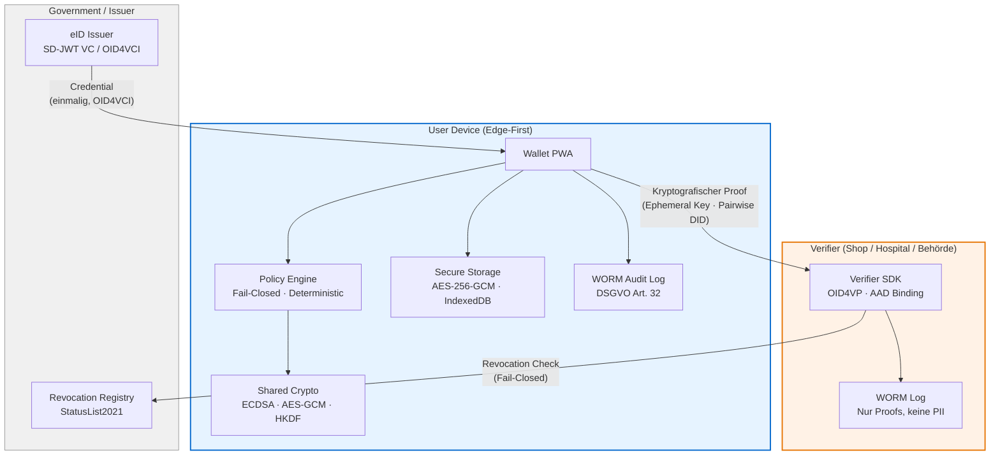
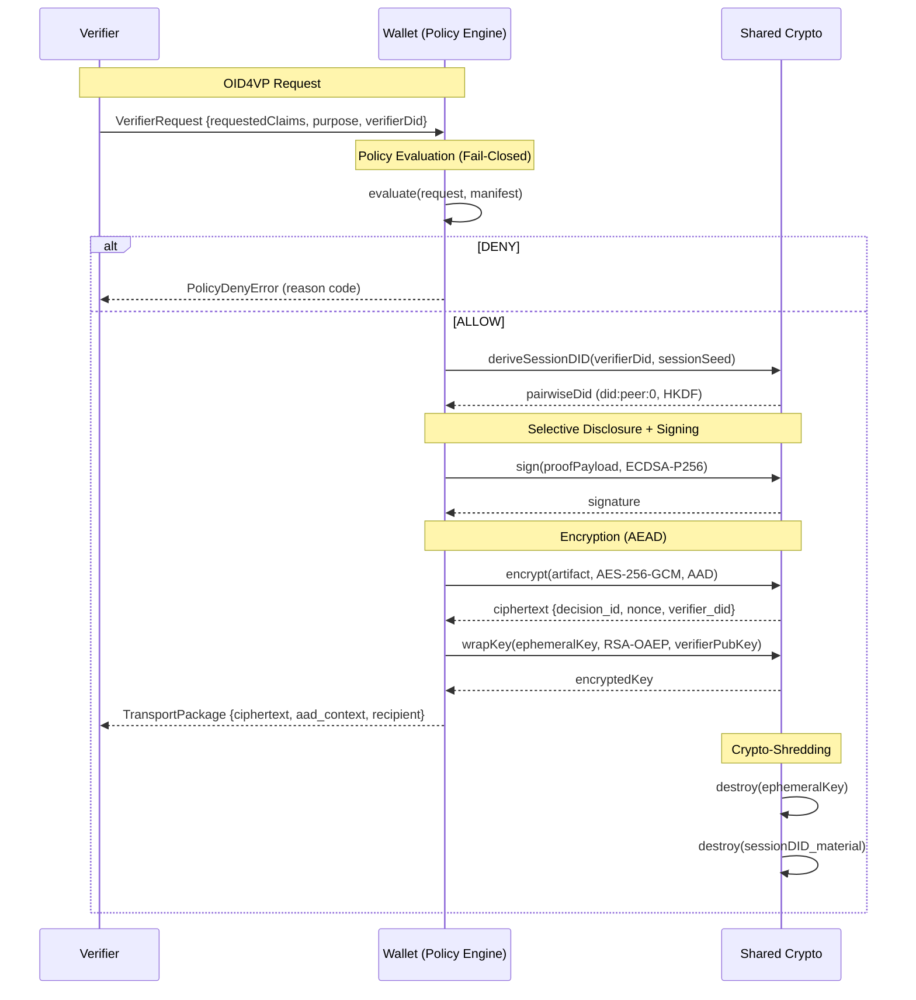
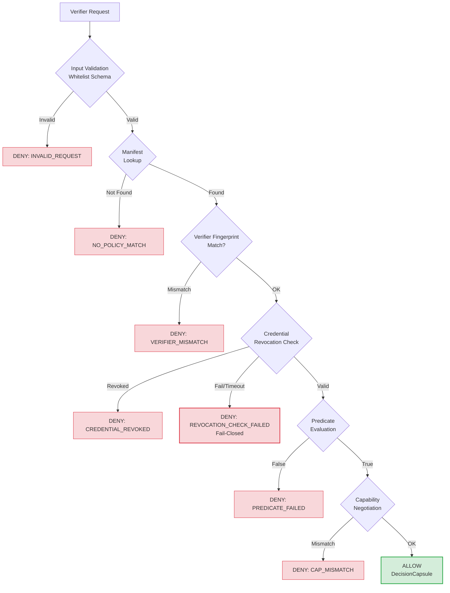
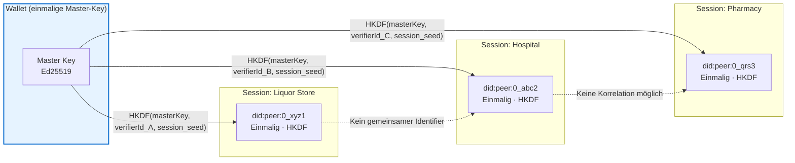
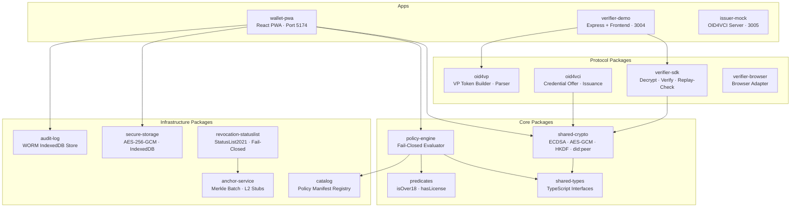

# miTch — Architektur-Diagramme

*Technische Übersicht für Uni-Präsentation und Developer Onboarding*

---

## Diagramm 1: System Overview (High-Level)

**Kernprinzip:** Identitätsdaten verlassen das Gerät nicht. Der Verifier empfängt ausschließlich kryptografische Beweise.

---

## Diagramm 2: Crypto Flow — Presentation Protocol

**Sicherheitseigenschaften:** AAD-Binding verhindert Replay-Angriffe. Pairwise DIDs verhindern Cross-Verifier-Korrelation. Crypto-Shredding eliminiert nach jeder Sitzung alle ephemeren Schlüssel.

---

## Diagramm 3: Policy Engine — Fail-Closed Decision Tree

**Fail-Closed:** Jeder Fehlerfall (Timeout, fehlende Daten, Revocation-Check-Fehler) resultiert in einem Deny. Kein "Silent Allow" unter Ungewissheit.

---

## Diagramm 4: Unlinkability — Pairwise DID Derivation (Spec 111)

**Unlinkability:** Jeder Verifier sieht eine andere DID. Kein Verifier kann Transaktionen eines Nutzers verifier-übergreifend verknüpfen — auch bei Kollusion.

---

## Diagramm 5: Monorepo Package-Struktur

---

## Technische Kennzahlen (Session 6 — 2026-03-06)

| Metrik | Wert |
|---|---|
| Turbo Tasks | 38/38 grün |
| Individual Tests | 760+ |
| npm Vulnerabilities | 0 |
| ESLint Errors | 0 |
| ESLint Warnings | 0 |
| P0 Gaps | 9/9 geschlossen |
| P1 Gaps | 5/5 geschlossen |
| OID4VP | E-01a–E-01d implementiert |
| OID4VCI | E-02 implementiert (32 Tests) |
| Unlinkability | U-01–U-05 implementiert |
| Security Hardening | S-01–S-05 implementiert |
