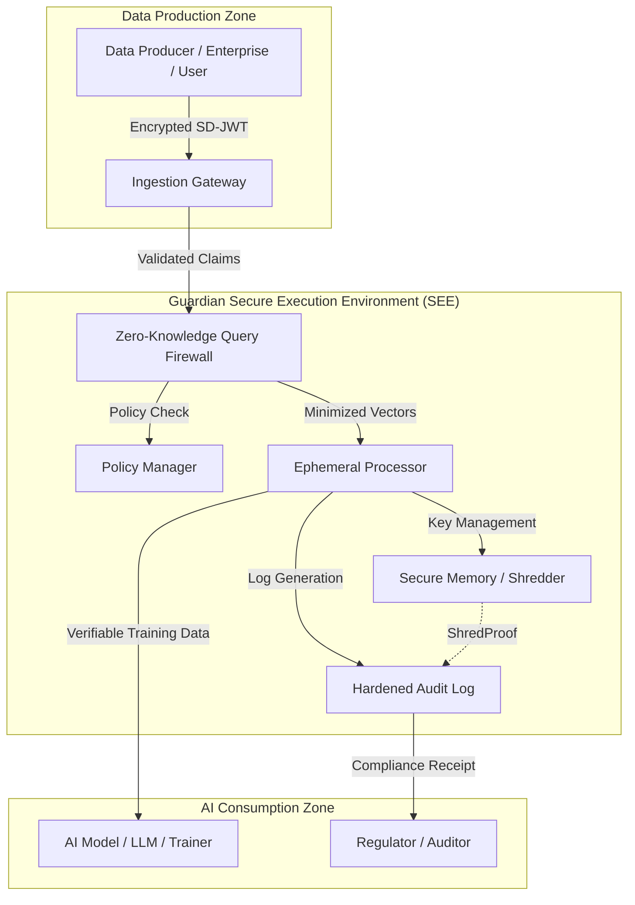

# AI-Guardian: High-Level Architecture (HLA)

## 1. System Overview
The AI-Guardian is a decoupled, high-assurance intermediary layer between **Data Producers** and **AI Consumers**. 

## 2. Component Diagram (Conceptual)

## 3. Core Technical Modules

### 3.1. Ingestion Gateway (Trust Anchor)
- **Market Need:** Universal compatibility.
- **Function:** Handles multiple identity formats (W3C VC, mDoc, X.509). It establishes the *provenance* of the data before it enters the firewall.

### 3.2. Zero-Knowledge Query Firewall (ZKQF)
- **Market Need:** Prevention of PII leakage.
- **Function:** A policy-driven engine that strips all identifiable data. For AI, it converts raw text/data into non-invertible embeddings (vectors) that retain utility but lose identity.

### 3.3. Ephemeral Processing Unit (EPU)
- **Market Need:** "Right to be Forgotten" enforcement.
- **Function:** Creates an isolated "Processing Window." It holds the decryption keys in volatile memory only. Once the training/inference task is done, it triggers an automatic "Crypto-Shredding" event.

### 3.4. Non-Repudiable Audit (NRA)
- **Market Need:** Judicial/Auditor-ready evidence.
- **Function:** Generates a "Compliance Capsule" for every batch. This capsule is cryptographically signed and anchored to an immutable ledger. It proves: "What data was used," "What policy was applied," and "When it was shredded."

## 4. Deployment Models

| Model | Market Fit | Description |
|-------|------------|-------------|
| **SaaS Gateway** | SMBs / Prosumers | A managed cloud service that cleans prompts before they reach OpenAI. |
| **On-Prem Node** | Enterprise B2B | A Dockerized appliance sitting inside the corporate network. |
| **Embedded Edge** | IoT / Automotive | A lightweight version running on edge devices to sanitize sensor data before cloud upload. |
