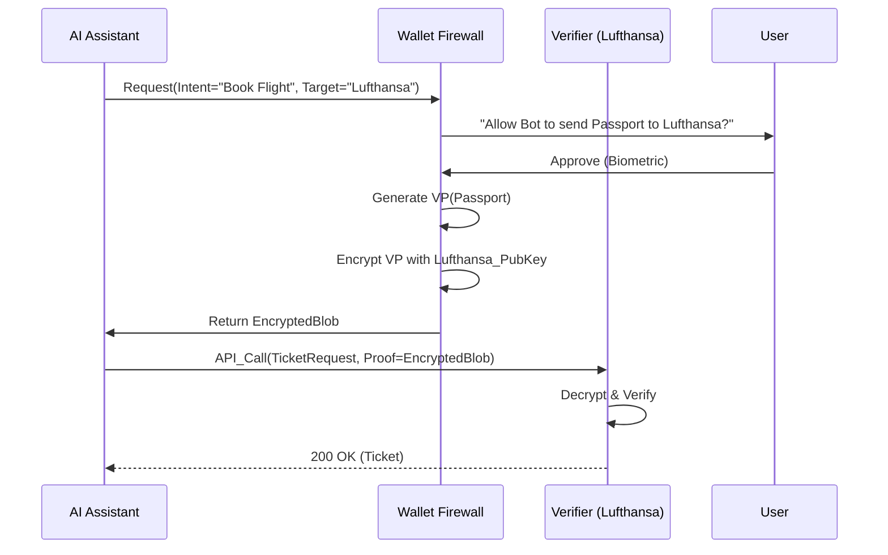

# T-32: "The AI Agent Jail" (Privacy Firewall for Autonomous Agents)

## 1. The Problem: The "Black Box" Risk
As AI Agents (e.g., AutoGPT, Gemini) begin performing tasks for users (booking flights, applying for jobs), they need access to PII.
*   **Current State**: Users copy-paste their Passport Number into the chat context.
*   **Risk**: The AI (or its provider) now permanently stores this PII in its training data/context window. Profiling becomes inevitable.

## 2. The Solution: miTch as the "Identity Firewall"
miTch intervenes in the Agent-API loop. The AI Agent never sees the raw PII. It only sees an **Opaque Authorization Token**.

### 2.1 Concept: Carrier Pigeon Protocol
1.  **Agent**: "I need your Passport to book Lufthansa Flight LH404."
2.  **miTch**: "I will not give YOU the passport. I will give you a **Sealed Envelope** (Verifiable Presentation) addressed ONLY to Lufthansa."
3.  **Agent**: Takes the envelope and sends it to Lufthansa API.
4.  **Lufthansa**: Opens envelope, verifies age/nationality, issues ticket.
5.  **Agent**: Sees "Ticket Issued" but never saw "Passport Number".

## 3. Technical Implementation

### 3.1 The "Blind Proxy" Design
*   **Audience Binding**: The VP is cryptographically bound to `aud: did:lufthansa`.
*   **Encryption**: The VP is encrypted with Lufthansa's Public Key.
*   **Agent Visibility**: The Agent receives a `base64` string. If it tries to decode it, it sees garbage.

### 3.2 Protocol Flow

### 3.3 Security Hardening: The "Key Injection" Attack
**Risk**: A malicious Agent requests a VP for "Lufthansa" but provides its *own* Public Key. If the wallet accepts this, the Agent can decrypt the data.
**Defense**: The Wallet **MUST NOT** accept keys provided strictly by the caller.
1.  **DID Resolution**: The Wallet must resolve `did:lufthansa` independently (via a Trusted Registry or Blockchain).
2.  **Key Pinning**: If an explicit key is proposed, its fingerprint must match the on-chain DID Document.
3.  **UI Warning**: If the key cannot be verified, the UI must warn: *"The target Identity cannot be verified. This might be a fake airline."*

## 5. Next Steps
1.  **Prototype**: Extend `WalletService.generatePresentation` to accept a `target_audience_key` different from the requestor.
2.  **Standardization**: Align with OIDC4VP "Cross-Device Flow".
